# Itqan CMS — System Architecture

This document provides an overview of the Itqan CMS system architecture from a product perspective, showing the main components, their responsibilities, how they interact, and where the system boundaries lie.

---

## Overview

Itqan CMS is a **Quranic Content Management System** designed to help **Publishers** distribute high-quality, licensed content while enabling **Developers** to integrate it into their applications.

```mermaid
flowchart TB
    subgraph External["External Users"]
        PUB["🏢 Publishers"]
        DEV["👨‍💻 Developers"]
    end

    subgraph ItqanCMS["Itqan CMS Platform"]
        CMS_API["CMS API<br/>(Internal Frontend)"]
        DEV_API["Developers API<br/>(Public)"]
        CORE["Core System"]
    end

    PUB -->|"Upload & Manage Content"| CMS_API
    PUB -->|"Download Resources (GUI)"| CMS_API
    PUB -->|"Create OAuth Clients"| CMS_API
    DEV -->|"OAuth Client Credentials"| DEV_API
    DEV -->|"Request Access & Consume"| DEV_API
    CMS_API --> CORE
    DEV_API --> CORE
```

---

## User Types

The system serves **two distinct sets of users**, each with their own API and authentication mechanism:

| User Type | API | Purpose |
|-----------|-----|---------|
| **Internal Frontend Users** | `cms-api` | Publishers and staff who upload, manage, and govern Quranic resources. They can also download resources via the GUI and create OAuth clients (client_id/client_secret) for programmatic access to the `developers-api` |
| **Developers** | `developers-api` | External developers who access and integrate resources into their apps using OAuth2 client credentials |

---

## Core Domain Models

The system is built around a hierarchy of content entities that ensure **authenticity**, **versioning**, and **controlled access**.

---

## Component Responsibilities

### 1. Publisher

The **Publisher** represents an organization or individual who owns and uploads original content.

- Uploads **Resources** (original, unmodified content)
- Manages licensing terms for their content
- Can require approval for each usage request or enable auto-approval
- Has members with roles (Owner, Manager)

### 2. Resource

A **Resource** is the **original, authoritative content** uploaded by a Publisher. It acts as the **source of truth** and remains unmodified.

- Belongs to a single Publisher
- Has a **Category**: `recitation`, `mushaf`, or `tafsir`
- Has a **License** (Creative Commons variants)
- Has a **Status**: `draft` or `ready`

### 3. ResourceVersion

Each **ResourceVersion** represents a specific uploaded file of a Resource, enabling **version tracking**.

- Uses **semantic versioning** (e.g., `1.0.0`, `1.1.0`)
- Contains the actual file (`storage_url`)
- Tracks file size

### 4. Asset

An **Asset** is a **derivation** of a Resource. It represents content that has been adapted or transformed for specific use cases.

> **Example**: A publisher uploads a Tafsir as a PDF (Resource). A contributor then creates a JSON version of the same Tafsir for API consumption — this becomes an Asset derived from the original Resource.

- Linked to a parent Resource
- Inherits or specifies its own license
- Can have multiple preview images
- For recitation assets: linked to a **Reciter** and **Riwayah**

### 5. AssetVersion

Similar to ResourceVersion, **AssetVersion** tracks each uploaded file version of an Asset.

- Linked to both an Asset and a ResourceVersion
- Contains the actual downloadable file
- Enables tracking of which Asset version corresponds to which Resource version

---

## Content Lifecycle

```mermaid
flowchart LR
    subgraph Publisher Flow
        A["📤 Upload Resource"] --> B["📝 Create ResourceVersion<br/>(v1.0.0)"]
        B --> C["✅ Set Status: Ready"]
    end

    subgraph Derivation Flow
        C --> D["🔄 Create Asset<br/>(Derived from Resource)"]
        D --> E["📝 Create AssetVersion<br/>(linked to ResourceVersion)"]
    end

    subgraph Version Updates
        B -.->|"New version"| F["📝 ResourceVersion<br/>(v1.1.0)"]
        E -.->|"New version"| G["📝 AssetVersion<br/>(linked to v1.1.0)"]
    end
```

---

## Access Control Flow

Publishers control how developers access their content through a **request-approval** workflow.

### Access Request States

| Status | Description |
|--------|-------------|
| `pending` | Request submitted, awaiting review |
| `approved` | Access granted |
| `rejected` | Access denied by publisher |

---

## Developer API Access

Developers can create **OAuth2 applications** via the CMS frontend to access the `developers-api` programmatically.

**Key Points:**
- Register account via CMS frontend
- Create OAuth application at `/o/applications/`
- Receive `client_id` and `client_secret`
- Use client credentials flow to obtain access tokens
- Make authenticated API requests

**📖 For complete OAuth flow diagrams, security best practices, and step-by-step guides, see [AUTHENTICATION.md](./AUTHENTICATION.md)**

---

## Distribution Channels

Assets can be distributed through multiple channels:

```mermaid
flowchart TB
    AV["AssetVersion"]

    AV --> D1["📥 FILE_DOWNLOAD<br/>Direct file download"]
    AV --> D2["🔌 API<br/>Programmatic access"]
    AV --> D3["📦 PACKAGE<br/>SDK/Library distribution"]
```

---

## Usage Tracking

The system tracks all interactions for analytics and auditing:

```mermaid
flowchart LR
    subgraph Events
        E1["👁️ View"]
        E2["📥 File Download"]
        E3["🔌 API Access"]
    end

    subgraph Subjects
        S1["Resource"]
        S2["Asset"]
    end

    E1 & E2 & E3 --> UE["UsageEvent"]
    UE --> S1
    UE --> S2

    UE --> Stats["📊 Analytics Dashboard"]
```

---

## System Boundaries

```mermaid
flowchart TB
    subgraph External
        Browser["🌐 CMS Frontend<br/>(Browser)"]
        DevApp["📱 Developer Apps"]
    end

    subgraph Itqan Platform
        subgraph APIs
            CMS["cms-api<br/>(django-allauth)"]
            PUB["developers-api<br/>(OAuth2)"]
        end

        subgraph Core
            Models["Domain Models"]
            Services["Business Logic"]
        end

        subgraph Storage
            DB[(PostgreSQL)]
            Files[(Cloudflare R2 /<br/>Local Storage)]
        end

        subgraph Background
            Celery["Celery Workers"]
            Redis[(Redis)]
        end
    end

    Browser --> CMS
    DevApp --> PUB
    CMS --> Models
    PUB --> Models
    Models --> Services
    Services --> DB
    Services --> Files
    Services --> Celery
    Celery --> Redis
```

---

## Recitation-Specific Components

For recitation-type assets, the system provides specialized tracking:

---

## Summary

| Component | Responsibility |
|-----------|---------------|
| **Publisher** | Content ownership and governance |
| **Resource** | Original, authoritative content |
| **ResourceVersion** | Version tracking for resources |
| **Asset** | Derived/transformed content for distribution |
| **AssetVersion** | Version tracking for assets |
| **AssetAccessRequest** | Developer access request workflow |
| **AssetAccess** | Granted access records |
| **Distribution** | Defines how assets are delivered |
| **UsageEvent** | Tracks all content interactions |

---

**See also:**
- [Authentication Guide](./AUTHENTICATION.md) — Complete OAuth flows and security practices
- [README.md](./README.md) — Quick start and project overview
