# Authentication Guide

This document explains how authentication works in Itqan CMS, covering both internal users and external developers.

---

## Overview

Itqan CMS uses **two distinct authentication systems** for different user types:

| User Type | API | Authentication Method | Use Case |
|-----------|-----|----------------------|----------|
| **Internal Frontend Users** | `cms-api` | django-allauth (Headless JWT) | Publishers and staff managing content |
| **Developers** | `developers-api` | django-oauth-toolkit (OAuth2) | External developers accessing resources programmatically |

---

## 1. Internal Frontend Users (CMS)

### Authentication System: django-allauth

The `cms-api` is designed for **Publishers** and **staff members** who manage the content platform.

### Features

- **Headless Mode**: API-first authentication using JWT tokens
- **Social Authentication**: Login with Google, GitHub, etc.
- **Email/Password**: Traditional email-based authentication
- **Multi-Factor Authentication (MFA)**: Optional TOTP, recovery codes, and WebAuthn
- **Session Management**: Track and manage active sessions

### Authentication Flow


### Key Endpoints (django-allauth)

| Endpoint | Method | Description |
|----------|--------|-------------|
| `/cms-api/auth/login` | POST | Login with email/password |
| `/cms-api/auth/signup` | POST | Register new account |
| `/cms-api/auth/logout` | POST | Logout and invalidate tokens |
| `/cms-api/auth/token/refresh` | POST | Refresh access token |
| `/cms-api/auth/providers/google` | GET | Google OAuth login |
| `/cms-api/auth/providers/github` | GET | GitHub OAuth login |

### Documentation

For detailed django-allauth headless documentation, see:
- [django-allauth Headless Documentation](https://docs.allauth.org/en/latest/headless/introduction.html)

---

## 2. Developers (OAuth2 Client Credentials)

### Authentication System: django-oauth-toolkit

The `developers-api` is designed for **external developers** who want to integrate Itqan resources into their applications.

---

## Developer Journey: Getting Started

### Step 1: Register an Account

Developers must first create an account via the **CMS Frontend GUI**.


**Registration Options:**
- Email/Password
- Google OAuth
- GitHub OAuth

---

### Step 2: Create an OAuth Application

After logging in, navigate to `/o/applications/` to create and manage OAuth applications.


### Application Configuration

When creating an application, you can configure:

| Field | Description | Example |
|-------|-------------|---------|
| **Name** | Application name | "My Quran App Backend" |
| **Client Type** | `Confidential` (recommended) or `Public` | Confidential |
| **Authorization Grant Type** | OAuth flow type | `Client credentials` |
| **Redirect URIs** | Callback URLs (not needed for client credentials) | N/A |

### Auto-Generated Credentials

Each application receives:

- **`client_id`**: Public identifier for your application
- **`client_secret`**: Secret key (treat like a password!)

> ⚠️ **IMPORTANT**: The `client_secret` is shown **only once** during creation. Store it securely!

---

### Step 3: Obtain an Access Token

Use the `client_credentials` grant type to obtain an access token.


### Token Request Example

```bash
curl -X POST https://api.itqan.com/o/token/ \
  -H "Content-Type: application/x-www-form-urlencoded" \
  -d "grant_type=client_credentials" \
  -d "client_id=YOUR_CLIENT_ID" \
  -d "client_secret=YOUR_CLIENT_SECRET"
```

**Response:**

```json
{
  "access_token": "AbCdEf123456...",
  "token_type": "Bearer",
  "expires_in": 3600,
  "scope": "read write"
}
```

---

### Step 4: Use the Access Token

Include the access token in the `Authorization` header for all API requests.


### API Request Example

```bash
curl -X GET https://api.itqan.com/assets \
  -H "Authorization: Bearer YOUR_ACCESS_TOKEN"
```

---

## Complete Developer OAuth Flow

```mermaid
flowchart TB
    Start["🚀 Start"] --> Register["1️⃣ Register Account<br/>(CMS Frontend)"]
    Register --> Login["2️⃣ Login to CMS"]
    Login --> CreateApp["3️⃣ Create OAuth Application<br/>(/o/applications/)"]
    CreateApp --> SaveCreds["4️⃣ Save client_id<br/>& client_secret"]

    SaveCreds --> Backend["5️⃣ Store credentials<br/>on Backend Server"]

    Backend --> RequestToken["6️⃣ Request Access Token<br/>POST /o/token/"]
    RequestToken --> ReceiveToken["7️⃣ Receive access_token"]

    ReceiveToken --> UseAPI["8️⃣ Make API Requests<br/>with Authorization header"]

    UseAPI --> TokenExpired{"Token<br/>Expired?"}
    TokenExpired -->|Yes| RequestToken
    TokenExpired -->|No| UseAPI

    style SaveCreds fill:#ff9
    style Backend fill:#f96
```



---

## Security Best Practices

### 🔐 Client Secret Protection

The `client_secret` represents **your application's identity** and access to our APIs.

| ✅ DO | ❌ DON'T |
|-------|----------|
| Store `client_secret` on your **backend server** | Embed in mobile apps or web frontend |
| Use environment variables or secret management | Commit to version control (Git) |
| Rotate credentials if compromised | Share credentials publicly |
| Keep credentials encrypted at rest | Hardcode in source code |

### Recommended Architecture

```mermaid
flowchart LR
    subgraph Client["Client-Side (Insecure)"]
        Mobile["📱 Mobile App"]
        Web["🌐 Web App"]
    end

    subgraph Backend["Your Backend Server (Secure)"]
        Server["🖥️ Backend API"]
        Secrets[("🔒 client_secret<br/>(Environment Variable)")]
    end

    subgraph Itqan["Itqan CMS"]
        DevAPI["developers-api"]
    end

    Mobile & Web -->|"User requests"| Server
    Server -->|"Uses client_secret"| DevAPI
    Secrets -.->|"Reads"| Server
    DevAPI -->|"Returns data"| Server
    Server -->|"Returns data"| Mobile & Web

    style Secrets fill:#f96
    style Server fill:#9f9
```



**Why?**
- Mobile apps and web frontends can be **decompiled or inspected**
- Anyone with your `client_secret` can impersonate your application
- Keep secrets on the backend where they're protected

---

## Rate Limiting & Fair Use

### Application Monitoring

Each OAuth application represents your usage of Itqan APIs. We monitor application behavior to ensure fair use.

### Enforcement Actions

| Violation | Example | Action |
|-----------|---------|--------|
| **Excessive Requests** | 1000+ requests/second | Rate limiting |
| **Denial of Service (DoS)** | Intentional API flooding | Client blocking |
| **Terms of Service Violation** | Unauthorized data scraping | Account suspension |

### Rate Limits (Default)

| User Type | Limit |
|-----------|-------|
| Anonymous | 100 requests/hour |
| Authenticated (OAuth) | 1000 requests/hour |

> 📧 **Need Higher Limits?** Contact us to discuss your use case and request a rate limit increase.

### Fair Use Policy

We reserve the right to:
- **Rate limit** applications making excessive requests
- **Temporarily block** clients engaged in abusive behavior
- **Permanently revoke** access for repeated violations

**Recommendations:**
- Implement **caching** to reduce API calls
- Use **exponential backoff** for retries
- **Batch requests** when possible
- Monitor your application's **error rates**

---

## OAuth2 Scopes (Future)

Currently, all authenticated applications have full read/write access. Future versions will support granular scopes:

| Scope | Description |
|-------|-------------|
| `read:assets` | Read asset metadata and download files |
| `read:resources` | Read resource metadata |
| `write:assets` | Upload and modify assets |
| `admin` | Full administrative access |

---

## Token Lifecycle

### Access Token Expiration

- **Lifetime**: 3600 seconds (1 hour)
- **Refresh**: Request a new token when expired
- **No Refresh Tokens**: Client credentials flow doesn't use refresh tokens

### Token Refresh Flow


---

## Troubleshooting

### Common Issues

| Error | Cause | Solution |
|-------|-------|----------|
| `401 Unauthorized` | Invalid or expired token | Request a new access token |
| `403 Forbidden` | Insufficient permissions | Check application scopes |
| `429 Too Many Requests` | Rate limit exceeded | Implement backoff and caching |
| `invalid_client` | Wrong client_id or client_secret | Verify credentials |

### Getting Help

- 📚 [django-oauth-toolkit Documentation](https://django-oauth-toolkit.readthedocs.io/)
- 📚 [django-allauth Documentation](https://docs.allauth.org/en/latest/)
- 📧 Contact: [support@itqan.com](mailto:support@itqan.com)

---

## Quick Reference

### For Publishers (Internal Users)

1. Login via CMS Frontend
2. Use `cms-api` with JWT tokens
3. Supports email/password and social login

### For Developers (External)

1. Register account on CMS Frontend
2. Create OAuth application at `/o/applications/`
3. Save `client_id` and `client_secret`
4. Request access token via `POST /o/token/`
5. Use token in API requests: `Authorization: Bearer {token}`
6. **Keep `client_secret` on backend server only!**

---

**See also:**
- [Architecture Documentation](./ARCHITECTURE.md)
- [API Documentation](http://localhost:8000/docs/)
