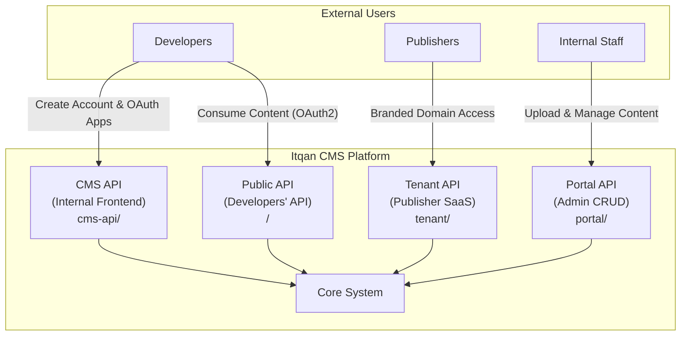
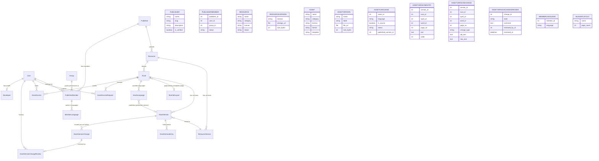
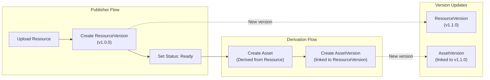
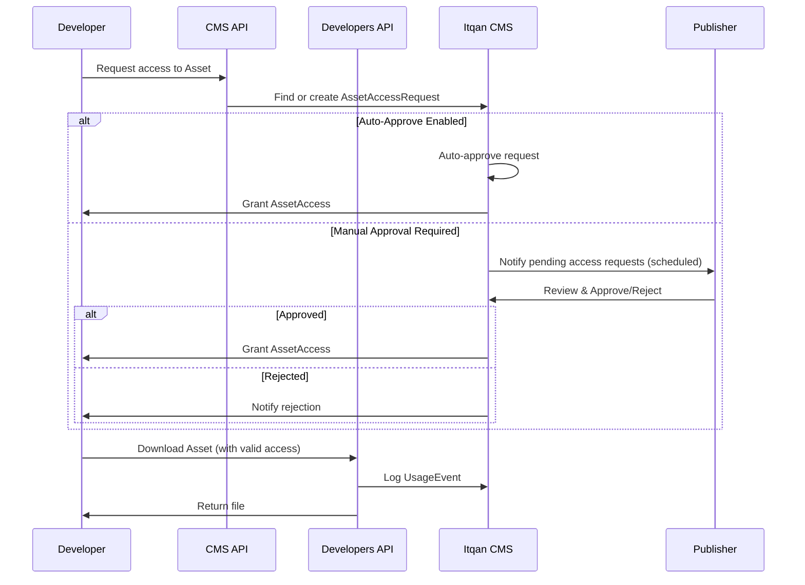
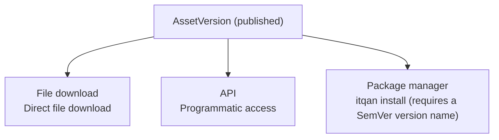
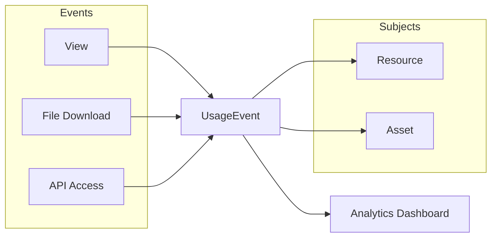
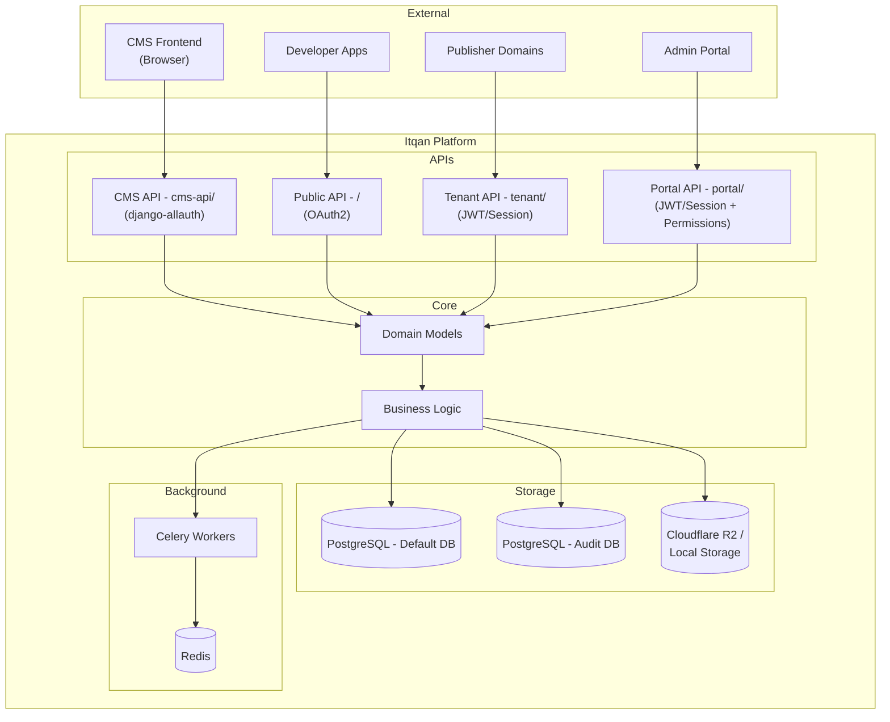
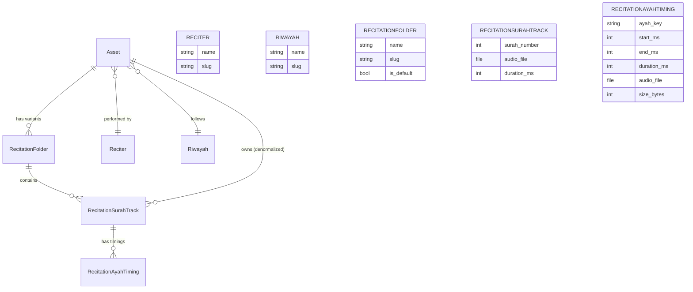

# Itqan CMS — System Architecture

This document provides an overview of the Itqan CMS system architecture from a product perspective, showing the main components, their responsibilities, how they interact, and where the system boundaries lie.

---

## Overview

Itqan CMS is a **Quranic Content Management System** designed to help **Publishers** distribute high-quality, licensed content while enabling **Developers** to integrate it into their applications.

---

## User Types

The system serves **four distinct API surfaces**, each with their own audience and authentication mechanism:

| API | Mount | Purpose | Authentication |
|-----|-------|---------|----------------|
| **CMS API** (Internal) | `cms-api/` | Powers the frontend SPA. Users can create accounts, explore the platform, and create OAuth applications. | django-allauth (JWT), social login (Google/GitHub) |
| **Public API** (Developers') | `/` (root) | Public-facing API consumed by external developers using OAuth applications created via the CMS API. **Expected to receive the majority of traffic.** | django-oauth-toolkit (OAuth2 client credentials) |
| **Tenant API** | `tenant/` | Multi-tenant SaaS API for publishers. Each publisher can have their own domain; content is filtered by the `Domain` the request originates from. All tenants share a single database. | JWT/Session |
| **Portal API** | `portal/` | Internal admin portal for uploading, writing, updating, and managing content (full CRUD). All users are internal company staff. | JWT/Session + group-based permissions |

---

## Core Domain Models

The system is built around a hierarchy of content entities that ensure **authenticity**, **versioning**, and **controlled access**.

---

## Component Responsibilities

### 1. Publisher

The **Publisher** represents an organization or individual who owns and uploads original content.

- Uploads **Resources** (original, unmodified content)
- Manages licensing terms for their content
- Can require approval for each usage request or enable auto-approval
- Has members, each assigned a **permission group** (`PublisherMember.group`, a Django `auth.Group`)
  - Members are invited by `group_id`; the group is chosen from `GET /portal/groups/`, not a fixed role list
  - The group is applied to the user's `auth` groups on invitation acceptance, and drives runtime authorization
  - Membership is per-publisher, so one user may hold a different group at each publisher they belong to
  - The `Itqan Internal` group holds every permission and is never listed or assignable through the portal APIs

### 2. Resource

A **Resource** is the **original, authoritative content** uploaded by a Publisher. It acts as the **source of truth** and remains unmodified.

- Belongs to a single Publisher
- Has a **Category**: `recitation`, `mushaf`, or `tafsir`
- Has a **License** (Creative Commons variants)
- Has a **Status**: `draft` or `ready`

### 3. ResourceVersion

Each **ResourceVersion** represents a specific uploaded file of a Resource, enabling **version tracking**.

- Uses **semantic versioning** (e.g., `1.0.0`, `1.1.0`)
- Contains the actual file (`storage_url`)
- Tracks file size

### 4. Asset

An **Asset** is a **derivation** of a Resource. It represents content that has been adapted or transformed for specific use cases.

> **Example**: A publisher uploads a Tafsir as a PDF (Resource). A contributor then creates a JSON version of the same Tafsir for API consumption — this becomes an Asset derived from the original Resource.

- Linked to a parent Resource
- Inherits or specifies its own license
- Can have multiple preview images
- For recitation assets: linked to a **Reciter** and **Riwayah**, and owns one or more
  **RecitationFolder** variants (see [Recitation-Specific Components](#recitation-specific-components))
- For text assets (translations and tafsirs): carries a **template** (`surah` / `ayah` /
  `word` / `page`) that fixes the granularity its entries are keyed to — chosen at
  creation and **immutable afterwards**. A `page`-template asset additionally links to
  a **MushafLayout** (its pagination), which every other template leaves unset.

### 5. AssetVersion

Similar to ResourceVersion, **AssetVersion** tracks each uploaded file version of an Asset.

- Linked to both an Asset and a ResourceVersion
- Contains the actual downloadable file
- Enables tracking of which Asset version corresponds to which Resource version
- For translations and tafsirs, an uploaded CSV is imported into per-unit entries. To
  guide uploaders the portal serves an empty fill-in CSV per template — one row per
  surah / ayah / word / page with a blank `text` column, in the same columns as a
  version export, so a filled-in sheet imports as is:
  `GET /portal/content/{category}/csv-template/?template=&mushaf_layout_id=` (asset
  creation; `page` needs the layout) and `GET /portal/content/{category}/{slug}/csv-template/`
  (an existing asset's template).
- For translations and tafsirs, `name` is the **version number** (`major.minor`, e.g.
  `7.0`) and `label` the human-readable version name. Each language has its own
  number sequence. The server issues the number when a version is committed,
  uploaded or restored, and it can't be edited afterwards (`PUT`/`PATCH` change only
  `label` and `summary`). The first version in a sequence takes the caller's
  `version_number` as its start (`version_number_required` /
  `version_number_invalid`); later ones bump the highest existing number by `bump`:
  `minor` (`7.1` → `7.2`, the default) or `major` (`7.1` → `8.0`). Drafts stay
  unnumbered (`name` is blank) until they are committed. Migration
  `0071_number_tafsir_translation_versions` renumbered existing versions from `1.0`
  in creation order and moved their old names to `label`.

### 6. MushafLayout

A **MushafLayout** describes one printed mushaf's pagination (e.g. "Madani 604" at
604 pages). Pages are opaque numbered slots with no stored page-to-ayah mapping (an
ayah can straddle a page boundary, which would make such a map lossy). Referenced by
`Asset.mushaf_layout` for `page`-template text assets, and by nothing else.
Migration `0068_seed_mushaf_layouts` seeds the two standard printings — Madinah
Mushaf (604 pages) and Shamarly Mushaf (522 pages) — so every environment has
layouts to choose from; further layouts are added through the portal.

---

## Content Lifecycle

### Multi-language content, availability & review

Text assets (translations & tafsirs) hold one source-language rendition plus any
number of translation renditions (`AssetLanguage`), each with its own version
history. Every commit — an editor draft committed, an uploaded or replaced version
file, a restore — records a per-unit delta (`AssetVersionChange`) against the
language's previous version, keyed to whichever unit the asset's template uses
(surah, ayah, word or page). Uploaded files must parse into entries
(`content_file_unparseable` otherwise), so their content can be reviewed, and must
not contain rows whose text would be dropped — a unit repeated with different text,
a unit that doesn't exist, or an unreadable row (`content_file_invalid_rows`, with
the row numbers in `extra.rows`); an upload identical to the previous version
records no changes. The stored file is then replaced by a CSV generated
from the parsed entries, so consumers download exactly what was reviewed.

- **Availability** — a language is consumable only when the asset is `READY`, the
  `AssetLanguage.status` is `READY` and it has a published version; translations
  start hidden until marked available, which needs a published version
  (`language_has_no_published_version`). The source language starts available and
  is toggled the same way (`PATCH .../languages/{language}/availability/`). A
  translation / tafsir with no available, published language is left out of the
  gallery (`assets/`) and recommendations (`consumer_visible_q`).
- **Commit vs publish** — committing makes a version the *head* (newest wins; what
  the editor builds on, `is_active` in the version list) but does **not** make it
  visible. Consumers (downloads, samples, `available_languages`, subscriber emails,
  Dependabot) are served `AssetLanguage.published_version`, read through
  `Asset.get_published_version()`. A holder of `PORTAL_PUBLISH_CONTENT`, assigned to
  the language, sets it with
  `POST /portal/content/{category}/{slug}/versions/{id}/set-published/` — only for a
  committed (`version_not_publishable`), fully approved (`version_not_approved`)
  version; any approved version may be published, so an older one is a rollback. A
  version is *approved* when, for every unit, its latest change at or before that
  version is approved (units with no change rows predate tracking and count as
  approved); the version list exposes `is_published`, `is_approved` and
  `pending_review_count`. The published version cannot be deleted or have its file
  replaced (`version_is_published`), and is never pruned when a newer commit lands;
  publishing a pruned version rebuilds its file. History is append-only: only the
  newest committed version of a language can be deleted or have its file replaced
  (`version_not_latest`), since later versions are stored as changes against it.
  Publishing and those changes lock the version row, so neither can slip in after
  the other's checks. Other categories keep newest-wins.
- **Viewing history** — any committed version is browsable read-only through the
  same entries endpoint the editor uses (`GET .../versions/{id}/` gives its name and
  language). A version pruned to deltas has its entries rebuilt on first view; the
  next commit prunes it again, along with the head it supersedes.
- **Editing** — changing a text asset's content (the content editor, uploading a
  version file, restoring a version) needs the per-category
  `PORTAL_EDIT_TRANSLATION_CONTENT` / `PORTAL_EDIT_TAFSIR_CONTENT`; `PORTAL_UPDATE_*`
  covers metadata only (names, descriptions, license, version label/summary,
  language availability). Both are limited to the member's assigned languages.
- **Reading entries** — the editor pages through
  `GET /portal/content/{category}/{slug}/versions/{id}/entries/` (`page`, `page_size`,
  optional `sura`). Its optional `filters` param is the grid's AG Grid filter model as
  JSON, keyed by `text`, `reference_text`, `source_text` (text filters, case-insensitive and
  ignoring Arabic vocalization — harakat, Quranic marks, alef forms, and Uthmani dagger alefs —
  so plain typing matches Uthmani text; a unit with no stored entry counts as empty) and `surah`, `sura`, `aya` (number filters,
  `inRange` inclusive; `surah` is the unit column's surah-name dropdown and `sura` the
  surah-number column, both applied), each a single condition or two joined by `AND`/`OR`. Filters
  narrow the whole unit set before paging, so `count` is the filtered total; unknown
  columns or malformed conditions return 400 `validation_error`. On a draft, each row's
  `changed` is true when its text differs from the language's latest committed version
  (what a commit would record; missing rows count as empty) — the editor highlights those
  cells. The autosave `PATCH` response carries the same flag for the rows it wrote.
- **Review** — reviewers with `PORTAL_REVIEW_CONTENT`, assigned to languages via
  `MemberLanguage`, approve or comment ("needs changes") each `AssetVersionChange`.
  State is stored one-per-change as `AssetVersionChangeReview` with
  `reviewed_by`/`reviewed_at` for auditing. Each listed change carries `edited_by`,
  the author (`created_by`) of the commit that made it — editor commits, uploads and
  restores all record theirs. `GET .../review/changes/` lists every change of a
  language, including ones a later commit replaced (so every version can be
  approved), each with `baseline_text` — the last text approved before its commit.
  With `version=<id>` it lists the changes that make up that version (the latest
  change per unit up to it), which is exactly what decides its approval;
  `GET .../review/versions/` lists the versions to pick from.
  `POST .../review/changes/bulk-approve/` approves many at once: the given
  `change_ids` (all must belong to the language, `change_not_found` otherwise), or
  without them every change matching the same `state`/`version` filter across all
  pages; already-approved changes keep their auditing. An upload can also be
  approved as it lands: `pre_approved=true` on the version upload approves its
  recorded changes under the uploader, who must also hold `PORTAL_REVIEW_CONTENT`
  (403 otherwise; replacing a file always goes back to review). Approval gates
  publishing (see above); reviewers cannot edit content.

---

## Access Control Flow

Publishers control how developers access their content through a **request-approval** workflow.

Developers submit requests through the CMS API at
`/cms-api/assets/{asset_id}/request-access/`. Repeated submissions reuse the latest
pending or approved request. A rejected request remains in the history and allows
a new submission.

### Access Request States

| Status | Description |
|--------|-------------|
| `pending` | Request submitted, awaiting review |
| `approved` | Access granted |
| `rejected` | Access denied by publisher |

Accept and reject act only on pending requests. The service locks the request
inside a transaction before checking its status, so one competing decision wins
and the other receives `409 invalid_status`.

Submissions lock the asset and, when present, the latest request to prevent
concurrent submissions from creating duplicate requests. Approval and grant
creation commit together. A grant is unique per developer and asset; approving a
later request (after a rejection or a duplicate) reuses that grant, re-links it to
the approving request, and refreshes it to the asset's current license with no
expiry. Outcome emails are queued
after the transaction commits.

---

## Developer API Access

Developers can create **OAuth2 applications** via the CMS frontend to access the public API programmatically.

**Key Points:**
- Register account via CMS frontend
- Create OAuth application at `/o/applications/`
- Receive `client_id` and `client_secret`
- Use client credentials flow to obtain access tokens
- Make authenticated API requests

**For complete OAuth flow diagrams, security best practices, and step-by-step guides, see [AUTHENTICATION.md](./AUTHENTICATION.md)**

### Client Release Identification

Consumers of `developers_api` may self-report which build is calling via two optional
request headers, so a defect can be attributed to the release that introduced it:

| Header | Constraint |
|---|---|
| `X-Client-Name` | ≤ 64 chars of `A-Z a-z 0-9 . _ -` |
| `X-Client-Version` | ≤ 32 chars of `A-Z a-z 0-9 . _ + -` |

`apps.core.middlewares.client_version.ClientVersionMiddleware` validates both, exposes
them as `request.client_name` / `request.client_version`, tags the Sentry scope
(`client.name`, `client.version`), and publishes them to the log context consumed by
`apps.core.logging_filters.ClientContextFilter`. `apps.usage_tracking` reads them off
the request and sends them to Mixpanel as `client_name` / `client_version`.

The values are **unverified and purely diagnostic** — they never influence identity,
authorization, or throttling. A malformed value is dropped rather than rejected, and the
response carries an advisory `X-Itqan-Warning` header; a missing header is silent.

---

## Distribution Channels

Every published `AssetVersion` is delivered through all channels; there is no per-channel opt-in:

See [`ASSET_MANIFEST.md`](./ASSET_MANIFEST.md) for how the package manager selects versions.

---

## Usage Tracking

The system tracks all interactions for analytics and auditing:

---

## System Boundaries

---

## Recitation-Specific Components

For recitation-type assets, the system provides specialized tracking:

### Folders (recitation variants)

A **RecitationFolder** sits between `Asset` and `RecitationSurahTrack`. It lets one
recitation be published in several forms — clear sound, with echo and delay, 128kbps,
320kbps, video — without splitting it into separate Assets, so the recitation keeps a
single page.

- Each folder holds its own set of up to 114 surah tracks.
- Uniqueness is `(folder, surah_number)`, **not** `(asset, surah_number)`: the same
  surah exists once per variant.
- Ayah timings hang off the track, so they are per-folder automatically — which matters
  because echo/delay variants have genuinely different offsets.
- Every recitation Asset gets exactly one folder flagged `is_default`, created by a
  `post_save` signal on `Asset` so the invariant also holds for assets made through
  Django admin, fixtures, or data imports.
- `Asset` is kept as a denormalized FK on the track alongside `folder`, because
  publisher scoping (`asset__publisher`) and most queries filter by asset. A model-level
  check rejects any track whose `folder.asset_id` disagrees with its `asset_id`.

**API surface.** No new top-level resources were added.

- Every recitation **track** endpoint accepts an optional `?folder=` filter, resolved by
  `find_folder_by_token`: the value may be a folder's slug **or** its name (matched
  case-insensitively across `name`, `name_ar`, `name_en`). Slug wins when both could
  match, since it is unique per asset. Names are not unique — two folders called "Clear"
  get slugs `clear` and `clear-1` — so an ambiguous name resolves to the default folder
  if present, otherwise the oldest. Omitting the parameter serves the default folder, so
  callers written before folders existed are unaffected. An unresolvable value returns
  `404 folder_not_found` rather than an empty list, so a typo is distinguishable from a
  variant that has no tracks yet.
- The public track endpoint's cache key embeds the **requested** `?folder=` value, not the
  resolved folder, so a warm cache still serves without a DB read. Because that value is
  user input, `folder_cache_token` sanitizes it first — slug-shaped values pass through for
  readability, anything else (spaces, Arabic, overlong input) is hashed, and case is folded
  so equivalent names share one entry.
- Every recitation **list** endpoint (public, tenant, internal) returns a `folders` array
  per row — name, slug, `is_default`, default first — so a consumer can discover the valid
  `?folder=` values. Only the portal API has a recitation *detail* endpoint; it carries the
  same array. The list queryset prefetches `recitation_folders`, so this costs one extra
  query per page rather than one per row.
- Folder CRUD is nested under the existing portal recitations resource at
  `/portal/recitations/{slug}/folders/`. The default folder cannot be deleted
  (`400 cannot_delete_default_folder`), since every other endpoint falls back to it.
- Renaming a folder deliberately does **not** change its slug: the slug is the public
  `?folder=` value, and moving it would break existing links and cached responses.

**Storage.** New uploads are keyed
`uploads/assets/{asset_id}/recitations/{folder_id}/{surah:03}.mp3`. Tracks uploaded
before folders existed keep their original flat keys — nothing in R2 was moved, and each
row stores its own full key, so both layouts coexist permanently.

Portal audio and ayah-timing uploads resolve the target recitation through the caller's
publisher scope. Multipart sign, completion, and abort operations also parse the supplied
storage key, require it to round-trip through the canonical key builder, and verify that
both its asset and folder belong to that scope before mutating object storage.

**Ayah-timing exports.** `sync_asset_recitations_json_file` writes one `AssetVersion`
per folder, named after the folder slug, so variants do not overwrite each other's JSON.

**Ayah-by-ayah sliced audio.** Per-ayah audio files are generated by the audio slicing
pipeline (`RecitationAudioSlicingService`) and stored deterministically under
`uploads/assets/{asset_id}/recitations/{folder_id}/{surah_number:03}/ayah_{ayah_number:03}.mp3`.
The resulting storage key and exact byte size are recorded directly on `RecitationAyahTiming`
(`audio_file` and `size_bytes`). The model uses `DeleteFilesOnDeleteMixin` to ensure that
associated per-ayah audio files in storage are deleted when a timing record is removed.
The public API serves these sliced files directly, falling back to proportional size estimates
only for un-sliced records.

---

## Summary

| Component | Responsibility |
|-----------|---------------|
| **Publisher** | Content ownership and governance |
| **Resource** | Original, authoritative content |
| **ResourceVersion** | Version tracking for resources |
| **Asset** | Derived/transformed content for distribution |
| **AssetVersion** | Version tracking for assets |
| **AssetAccessRequest** | Developer access request workflow |
| **AssetAccess** | Granted access records |
| **UsageEvent** | Tracks all content interactions |

---

**See also:**
- [Authentication Guide](./AUTHENTICATION.md) — Complete OAuth flows and security practices
- [Audit History Guide](./audit-history.md) — Comprehensive guide on django-simple-history, dual-database routing, and tracked models
- [Roadmap](./ROADMAP.md) — Planned features: app/user self-identification auth,
  ayah-by-ayah recitation delivery, developer-ready data views, Itqan Dependabot &
  asset package manager
- [README.md](./README.md) — Quick start and project overview
