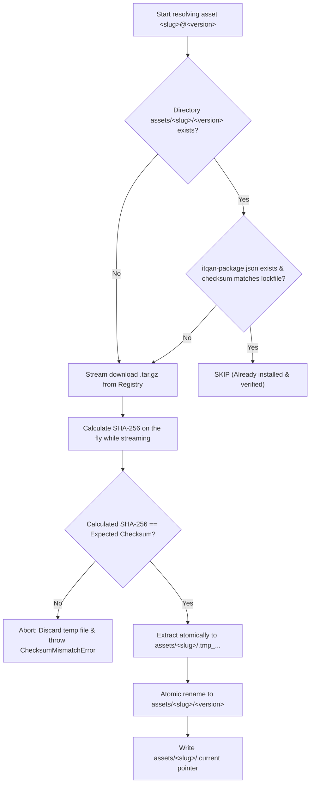

# Itqan Asset Package Artifact Specification

**Status**: Proposed V1  
**Target Quarter**: Q2 1448 · **Task ID**: ITQ-26 ([#425](https://github.com/Itqan-community/cms-backend/issues/425))  
**Artifact format version**: 1 · **Manifest schema version**: 1  

This document defines the physical packaging, internal structure, checksum integrity, client directory layout, and build lifecycle for distributable Itqan content assets.

It serves as the formal contract between:
- The **Content CMS** (`apps/content`): where versioned asset entities and entries are authored and published.
- The **Package Registry API** (`apps/package_manager/api/public` / [#417](https://github.com/Itqan-community/cms-backend/issues/417)): which serves download references and integrity metadata for resolved artifacts.
- The **CLI Installer** (`apps/package_manager/cli` / [#422](https://github.com/Itqan-community/cms-backend/issues/422)): which downloads, verifies, and unpacks artifacts into a consumer project's `assets/` directory.
- The **Asset Manifest & Lockfile** ([`docs/ASSET_MANIFEST.md`](./ASSET_MANIFEST.md)): which pins resolved versions and coordinates ecosystem dependency resolution.

---

## Table of Contents

1. [Architectural Context & Motivation](#1-architectural-context--motivation)
2. [Package Archive Format (.tar.gz)](#2-package-archive-format-targz)
3. [Internal Package Manifest: `itqan-package.json`](#3-internal-package-manifest-itqan-packagejson)
4. [Category Payload Layouts](#4-category-payload-layouts)
5. [Client Installation Layout under `assets/`](#5-client-installation-layout-under-assets)
6. [Integrity Metadata, Verification & Idempotency](#6-integrity-metadata-verification--idempotency)
7. [Mapping to `Distribution` Model & `PACKAGE` Channel](#7-mapping-to-distribution-model--package-channel)
8. [Artifact Build Lifecycle (On Publish vs. On Demand)](#8-artifact-build-lifecycle-on-publish-vs-on-demand)
9. [Registry API Contract & Lockfile Evolution](#9-registry-api-contract--lockfile-evolution)
10. [Security and Extraction Invariants](#10-security-and-extraction-invariants)

---

## 1. Architectural Context & Motivation

### The Problem
In the CMS backend, an asset version is not stored as a single deployable file. Instead, it is persisted across relational database rows and optional media files:
* `Asset`: Root metadata (slug, name, category, language, license, publisher).
* `AssetVersion`: Version header (SemVer name, state, creation timestamp).
* `AssetVersionEntry`: Granular per-ayah records (up to 6,236 rows for text-based translations and tafsirs).
* Supporting models: `RecitationSurahTrack`, `RecitationAyahTiming`, fonts, and page image files.

Without a defined artifact format:
1. The **Registry API** cannot provide deterministic download URLs or checksums for content that only exists across database rows.
2. The **Installer CLI** does not know whether to expect raw files, JSON dumps, or archives, nor how to unpack and organize them for consumption.
3. The **Updater (Dependabot)** cannot verify lockfile freshness against stable binary identities.

### The Solution: The Packaged Artifact
A published `AssetVersion` distributed on the `PACKAGE` channel is compiled into a single, immutable, deterministically compressed archive:
```
<asset-slug>-<canonical-version>.tar.gz
```
This archive contains machine-readable metadata (`itqan-package.json`) and structured content payloads under `data/`.

---

## 2. Package Archive Format (.tar.gz)

### Container Choice: Gzipped Tarball (`.tar.gz`)
The official artifact container for Itqan packages is **gzip-compressed TAR (`.tar.gz`)**.

**Rationale**:
* **High Compression Efficiency**: Islamic text assets (translations, tafsirs, linguistic datasets) are predominantly UTF-8 JSON text. Gzip compression achieves 70–85% reduction in size.
* **POSIX & Ecosystem Standard**: Standard container across package ecosystems (npm tarballs, Homebrew bottles, Alpine packages, Go modules).
* **Streaming Friendly**: Can be inspected, validated, and extracted in streaming mode without loading entire archives into memory.
* **Platform Independence**: Standard library support across all major programming platforms (`tarfile` in Python, `archive/tar` in Go, `tar` in Rust/C/Node).

### Deterministic Compression Specification
To guarantee that two independent builds of the exact same asset version produce byte-identical archives and identical checksums, archive creation must strictly adhere to the following reproducibility invariants:
1. **File Ordering**: Archive entries must be sorted strictly in ascending lexicographical byte order of their relative paths.
2. **Normalized Timestamps (`mtime`)**: Every file's modification time in the tar header must be set to UNIX epoch zero (`1970-01-01T00:00:00Z`).
3. **Owner & Group Normalization**: User ID (`uid`) and group ID (`gid`) must be forced to `0` (`root`), with `uname` and `gname` set to empty strings.
4. **File Permissions (`mode`)**: 
   * Directories: `0o755` (`rwxr-xr-x`).
   * Regular files: `0o644` (`rw-r--r--`).
5. **Gzip Header Normalization**: The gzip encapsulation header must set `mtime = 0`, `os = 255` (unknown OS), and contain no original filename or extra metadata flags.

---

## 3. Internal Package Manifest: `itqan-package.json`

Every package archive must include an `itqan-package.json` manifest at its root. This file describes the package identity, licensing, and contents.

### Example Manifest
```json
{
  "schema_version": 1,
  "asset": {
    "slug": "quran-uthmani-hafs",
    "name": "القرآن الكريم برواية حفص عن عاصم بالرسم العثماني",
    "category": "mushaf",
    "language": "ar",
    "license": "CC-BY-NC-ND",
    "publisher": {
      "id": 1,
      "name": "مجمع الملك فهد لطباعة المصحف الشريف"
    }
  },
  "version": {
    "name": "2.4.1",
    "published_at": "2026-08-15T10:30:00Z"
  },
  "content": {
    "entry_count": 6236,
    "primary_data_file": "data/entries.json"
  },
  "files": [
    {
      "path": "data/entries.json",
      "size_bytes": 1845920,
      "checksum": "sha256:7b91d297d028bfa693998f828a2a7522d0577da71dc1c1f067d020059f38f711"
    }
  ]
}
```

### Schema Definition
| Field | Type | Required | Description |
|---|---|---|---|
| `schema_version` | integer | yes | Must be `1`. Schema version of the package manifest. |
| `asset.slug` | string | yes | Unique asset slug matching the CMS and registry catalog. |
| `asset.name` | string | yes | Primary localized asset name. |
| `asset.category` | string | yes | Category matching `CategoryChoice` (e.g., `translation`, `tafsir`, `mushaf`, `font`). |
| `asset.language` | string | yes | ISO language code of this rendition (e.g., `ar`, `en`, `fr`). |
| `asset.license` | string | yes | Standard license code (e.g., `CC-BY-NC-ND`, `PUBLIC_DOMAIN`). |
| `asset.publisher.id` | integer/null | no | CMS publisher identifier if applicable. |
| `asset.publisher.name` | string/null | no | Publisher display name. |
| `version.name` | string | yes | Canonical 3-component SemVer version string (e.g., `2.4.1`). |
| `version.published_at` | string (ISO-8601) | yes | Timestamp when this version was published. |
| `content.entry_count` | integer | no | Total content items (e.g. 6236 ayahs for full Quran coverage). |
| `content.primary_data_file` | string | yes | Path to main entrypoint relative to package root. |
| `files` | array | yes | List of files included in the archive with sizes and SHA-256 digests. |

---

## 4. Category Payload Layouts

Content payloads are located in the `data/` directory inside the package archive.

### 4.1. Translation and Tafsir (`translation`, `tafsir`)
Text content stored in `AssetVersionEntry` rows is serialized into a standard UTF-8 JSON array:
```
data/
└── entries.json
```
**Structure of `data/entries.json`**:
```json
[
  {
    "sura": 1,
    "aya": 1,
    "text": "In the name of Allah, the Entirely Merciful, the Especially Merciful."
  },
  {
    "sura": 1,
    "aya": 2,
    "text": "[All] praise is [due] to Allah, Lord of the worlds -"
  }
]
```
For sparse assets (e.g., partial translations or selected commentaries), only available ayahs are included, ordered by canonical Quranic index (`order`).

### 4.2. Fonts (`font`)
Fonts distributed as packages bundle binary typeface assets and glyph mapping metadata:
```
data/
├── metadata.json
├── quran-hafs.woff2
├── quran-hafs.ttf
└── glyph-map.json
```

### 4.3. Mushaf Page Renditions (`mushaf`)
For image-based or vector Mushafs, pages and coordinate bounding boxes (ayah boundary polygons) are structured hierarchically:
```
data/
├── manifest.json
├── pages/
│   ├── page_001.png
│   ├── page_002.png
│   └── ...
└── boundaries/
    ├── page_001_ayahs.json
    └── ...
```

### 4.4. Audio Recitations (`recitation`)
Recitation packages provide standardized track metadata, timing markers (`RecitationAyahTiming`), and manifest references:
```
data/
├── tracks.json
├── timings/
│   ├── 001.json
│   └── ...
└── audio/
    ├── 001.mp3
    └── ...
```

---

## 5. Client Installation Layout under `assets/`

When a developer runs `itqan install` via the CLI, the package is verified and unpacked into the project's local directory structure.

### 5.1. Directory Structure
```text
<project-root>/
├── itqan-assets.yaml
├── itqan-assets.lock
└── assets/
    └── <asset-slug>/
        └── <version>/
            ├── itqan-package.json
            └── data/
                ├── entries.json
                └── ...
```

### 5.2. Installation Rules
1. **Versioned Subdirectory Isolation**:
   Every installed version is unpacked into `assets/<asset-slug>/<version>/`. 
   * Installing version `2.4.1` writes into `assets/quran-uthmani-hafs/2.4.1/`.
   * Multiple versions can co-exist if needed during migrations, and updates never execute in-place overwrites of active files.
2. **Current Version Pointer**:
   To simplify application asset loading, the installer maintains a lightweight JSON pointer file:
   ```text
   assets/<asset-slug>/.current
   ```
   Containing:
   ```json
   {
     "version": "2.4.1",
     "installed_at": "2026-09-16T18:00:00Z"
   }
   ```
   *(Note: Symlinks are avoided by default because Windows non-developer environments restrict symlink creation without elevated privileges).*
3. **Atomic Unpacking**:
   Extraction proceeds into a temporary staging folder in the same filesystem:
   ```text
   assets/<asset-slug>/.tmp_<version>_<random>/
   ```
   Once fully written and verified, it is atomically renamed via `os.replace` to `assets/<asset-slug>/<version>/`. Partial extracts never linger upon download or extraction failure.

---

## 6. Integrity Metadata, Verification & Idempotency

### 6.1. Integrity Standard: SHA-256
Package integrity is identified by a cryptographic SHA-256 checksum formatted with standard algorithm prefixing:
```text
sha256:<64-hexadecimal-characters>
```
*Example*:
```text
sha256:4a355938f22691d4e32537299214ad5f413044b604b49e45d5676019a0a2ad9f
```

### 6.2. Two Levels of Verification
1. **Archive Level (Transport Integrity)**:
   The SHA-256 digest of the raw `.tar.gz` file. The Registry API serves this value, and the installer verifies it during streaming before unpacking.
2. **File Level (Content Integrity)**:
   Inside `itqan-package.json`, every individual file under `data/` has its individual SHA-256 recorded in the `files` array. If local files are suspected of corruption, `itqan verify` can audit files in place.

### 6.3. Idempotency Flow for `itqan install`
The installer enforces strict idempotency to prevent redundant network downloads and disk writes:



---

## 7. Mapping to `Distribution` Model & `PACKAGE` Channel

### Existing Backend Model
The CMS content app defines:
```python
class Distribution(BaseModel):
    class ChannelChoice(models.TextChoices):
        FILE_DOWNLOAD = "FILE_DOWNLOAD", _("File Download")
        API = "API", _("API")
        PACKAGE = "PACKAGE", _("Package")

    asset_version = models.ForeignKey(AssetVersion, related_name="distributions")
    channel = models.CharField(max_length=20, choices=ChannelChoice.choices)
```

### Extending Package Channel Representation
For a version to be served by the package manager ecosystem:
1. It must have a `Distribution` record where `channel = ChannelChoice.PACKAGE`.
2. The package artifact metadata is associated with this distribution:
   * **`artifact_file`**: Path to the built `.tar.gz` in Django Storage (e.g. `packages/<slug>/<slug>-<version>.tar.gz`).
   * **`checksum`**: `sha256:<hex>` string computed upon build.
   * **`size_bytes`**: Integer byte length of the `.tar.gz` archive.
   * **`status`**: State machine (`PENDING`, `BUILDING`, `READY`, `FAILED`).
3. Only records with `status = READY` are served with valid `download_url` references in the Registry API.

---

## 8. Artifact Build Lifecycle (On Publish vs. On Demand)

### Architectural Decision: Asynchronous "On Publish"

We explicitly adopt the **Asynchronous On-Publish** strategy over on-demand building.

| Dimension | On Demand | Asynchronous On Publish (Chosen) |
|---|---|---|
| **API Latency** | High (500ms–15s to query DB, serialize 6k rows, compress) | Instant (< 20ms, returns CDN direct storage URL) |
| **Server Load** | Spikes during release events (CPU & Memory saturation) | Amortized (built once, cached forever) |
| **Reproducibility** | Risk of timestamp differences and DB read inconsistencies | Guaranteed (immutable binary artifact stored in Object Storage) |
| **Offline Reliability** | Dependent on live database availability | Served from Object Storage / Edge CDN |

### The Build Workflow
1. **Trigger**:
   When an admin or editor transitions an `AssetVersion.state` to `PUBLISHED` (and a `Distribution(channel=PACKAGE)` exists or is created).
2. **Background Task Execution**:
   A Celery background task (`build_package_artifact(asset_version_id)`) is queued:
   * Fetches the `AssetVersion` and all corresponding `AssetVersionEntry` records ordered by canonical Ayah sequence.
   * Generates the `itqan-package.json` manifest.
   * Writes the category payload (`data/entries.json`, fonts, etc.) into an in-memory or temp buffer.
   * Compresses the directory deterministically into `.tar.gz` (normalized timestamps and permissions).
   * Computes the SHA-256 checksum and measures the file size.
   * Saves the `.tar.gz` to Django's default storage backend (S3 / Cloud Storage / MinIO).
   * Updates the `Distribution` record with `checksum`, `size_bytes`, `artifact_file`, and marks `status = READY`.
3. **Immutability Invariant**:
   Once published and packaged, an artifact is **strictly immutable**. If content edits are required, they must be published under a new SemVer version (`AssetVersion`). An existing artifact file is never modified or overwritten in place.

---

## 9. Registry API Contract & Lockfile Evolution

### 9.1. Registry API Payload (`PackageVersionOut`)
The Registry API (`GET /api/public/packages/resolve/` and `POST /api/public/packages/resolve/manifest/`) updates its response schema to return artifact identity and integrity metadata:

```json
{
  "slug": "quran-uthmani-hafs",
  "asset_name": "القرآن الكريم برواية حفص عن عاصم بالرسم العثماني",
  "asset_version_id": 42,
  "resolved_version": "2.4.1",
  "publisher_id": 1,
  "publisher_name": "مجمع الملك فهد لطباعة المصحف الشريف",
  "download_url": "https://cdn.itqan.dev/packages/quran-uthmani-hafs/quran-uthmani-hafs-2.4.1.tar.gz",
  "checksum": "sha256:4a355938f22691d4e32537299214ad5f413044b604b49e45d5676019a0a2ad9f",
  "size_bytes": 1420850
}
```

### 9.2. Evolution of `itqan-assets.lock` (Lockfile V2 Path)
In `docs/ASSET_MANIFEST.md` §5, `itqan-assets.lock` was defined with `lockfile_version: 1` without checksums because artifact identity was deferred to this specification.

With this specification established, the lockfile format advances to support checksum integrity without breaking backward compatibility:
```yaml
lockfile_version: 2
manifest_schema_version: 1

assets:
  "mushaf-madinah":
    constraint: "~1.2"
    version: "1.2.4"
    integrity: "sha256:a1b2c3d4..."
  "quran-uthmani-hafs":
    constraint: "^2.1.0"
    version: "2.4.1"
    integrity: "sha256:4a355938..."
```

---

## 10. Security and Extraction Invariants

To guarantee safe operation in developer and CI environments, consumers extracting Itqan packages must enforce the following invariants:

1. **Path-Traversal Protection (Anti-TarSlip)**:
   Extractors must validate every member in the `.tar.gz` archive before writing to disk. Any entry with:
   * Absolute paths (e.g. `/etc/passwd`, `C:\Windows\System32`), or
   * Directory traversal segments (e.g. `../../bad.txt`)  
   must immediately abort extraction with a `PathTraversalError`.
2. **Max Decompression Ratio (Anti-ZipBomb)**:
   Extractors must limit maximum uncompressed size (e.g., maximum uncompressed expansion ratio of 100:1 or 250 MB max per package) to mitigate denial-of-service attempts.
3. **No Executable Files**:
   Packages contain data, media, and metadata only. No executable bits or symlinks to system executables are permitted. Any file bearing executable permissions (`+x`) in the tar header is stripped down to `0o644`.
