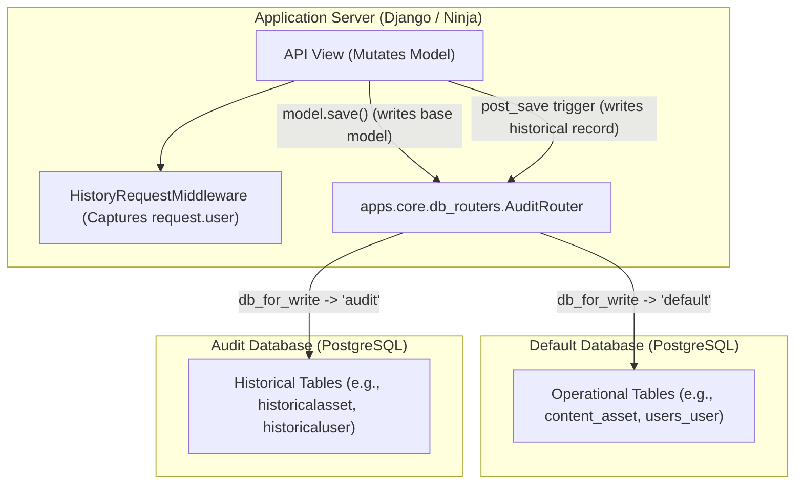

# Audit History — Developer Guide

This document describes the audit history architecture in Itqan CMS, how `django-simple-history` is configured across models, how records are routed to the dedicated `audit` database, and how to maintain tracked models.

---

## Architecture Overview

Audit logging in Itqan CMS uses [`django-simple-history`](https://django-simple-history.readthedocs.io/) with a dual-database setup:
- **`default` database**: Stores all primary operational application data (`users`, `publishers`, `content`, `quran`).
- **`audit` database**: Stores all historical audit trail tables (`simple_history` app).

The separation is enforced at runtime via `apps.core.db_routers.AuditRouter`.



---

## Adding History to a Model

1. **Add the `history` field** to the model definition:

   ```python
   from django.db import models
   from simple_history.models import HistoricalRecords

   class MyModel(BaseModel):
       # ... fields ...
       history = HistoricalRecords(
           app="simple_history",
           use_base_model_db=False,
           history_user_id_field=models.BigIntegerField(null=True),
       )
   ```

   > [!IMPORTANT]
   > **All three parameters are mandatory:**
   >
   > - **`app="simple_history"`**: Sets the generated historical model's `app_label` to `simple_history`. This is required by `apps.core.db_routers.AuditRouter` to correctly route historical tables to the `audit` database.
   > - **`use_base_model_db=False`**: Instructs `django-simple-history` to respect `DATABASE_ROUTERS` instead of writing to the tracked model's database. Omitting it silently routes history tables to `default`.
   > - **`history_user_id_field=models.BigIntegerField(null=True)`**: Stores the authenticated user's ID as a plain scalar column instead of a Django `ForeignKey`. This eliminates cross-database relational constraint errors between the `audit` database and the `default` database.

2. **ForeignKey String Qualification Rule**:
   When defining string-based ForeignKey references on a model with `history` (e.g. self-referential or same-app models), **always use the fully qualified app label** (e.g. `"content.Asset"` instead of `"Asset"`). Because historical models belong to `app_label="simple_history"`, unqualified strings will otherwise resolve against `simple_history.<Model>` and trigger migration errors (`fields.E300`/`fields.E307`).

3. **Generate the migration**:
   Historical model migrations are redirected to `apps/core/audit_migrations/` via `settings.MIGRATION_MODULES`:

   ```bash
   uv run python manage.py makemigrations
   ```

4. **Apply to both databases**:

   ```bash
   # 1. Apply to default DB (records migration state; router skips historical tables)
   uv run python manage.py migrate

   # 2. Apply to audit DB (creates historical tables in the audit database)
   uv run python manage.py migrate --database=audit
   ```

---

## Tracked Models (27 Models)

All mutable business and content entities are tracked in the audit trail:

### `apps.users` (3 models)
| Model | Description |
|-------|-------------|
| `User` | User accounts, roles, and profiles |
| `APIKey` | API authentication keys |
| `Developer` | External developer profiles |

### `apps.publishers` (5 models)
| Model | Description |
|-------|-------------|
| `Publisher` | Publisher organization details |
| `PublisherMember` | Publisher membership and role mappings |
| `Domain` | Custom tenant domains associated with publishers |
| `PublisherMemberInvitation` | Invitations to join publisher organizations |
| `MemberLanguage` | Language specializations for publisher members |

### `apps.content` (19 models)
| Category | Models |
|----------|--------|
| **Core Assets & Versions** | `Asset`, `AssetLanguage`, `AssetVersion`, `AssetVersionEntry`, `AssetVersionChange`, `AssetVersionChangeReview`, `AssetPreview`, `AssetAccessRequest`, `AssetAccess` |
| **Recitation & Metadata** | `Reciter`, `Qiraah`, `Riwayah`, `MushafLayout`, `RecitationFolder`, `RecitationSurahTrack`, `RecitationAyahTiming` |
| **Editorial & Reports** | `ContentIssueReport`, `EditorialRecommendation`, `EditorialRecommendationAsset` |

---

## Explicit Exclusions

The following models are **intentionally not tracked** by `django-simple-history`:

1. **`apps.content.models.UsageEvent`**:
   - High-volume, append-only telemetry/analytics events (views, downloads, API hits).
   - Slated for migration to a dedicated metrics store; adding historical versioning would double write IOPS with zero audit utility.
2. **`apps.quran` (`Sura`, `Ayah`, `Word`)**:
   - Canonical reference data of the Holy Quran.
   - Seeded from authoritative static datasets and completely immutable at application runtime.
3. **`apps.core`**:
   - Contains abstract base models (`BaseModel`, `TenantModel`), not concrete tables.

---

## User Attribution Flow

```
HistoryRequestMiddleware
  └─ sets HistoricalRecords.context.request = request  (live reference)
      └─ calls get_response(request)
          └─ Ninja view dispatch
              └─ auth class sets request.user = authenticated_user
                  └─ view logic → model.save()
                      └─ simple_history reads .context.request.user → correct user ID
```

The middleware stores a reference to the active `request` object (not a snapshot). Ninja auth mutates `request.user` on that same object during view execution. When `model.save()` triggers the post-save signal, `django-simple-history` inspects the context request and stores the user's primary key into `history_user_id`.

---

## Migration Architecture

Historical models belong to the third-party `simple_history` app. To ensure all migrations remain committed to source control and are tracked alongside application code:

```python
# config/settings/base.py
MIGRATION_MODULES = {
    "simple_history": "apps.core.audit_migrations",
}
```

This ensures `manage.py makemigrations` and `manage.py makemigrations --check` automatically manage historical migrations under `apps/core/audit_migrations/`.

---

## Operational Impact & Performance

- **Write Amplification**: Every create, update, or soft/hard delete on a tracked model generates a corresponding row in the historical table on the `audit` database. This results in approximately ~2x write queries for tracked model mutations.
- **Zero Read Overhead**: Normal application read queries (`SELECT`) only target the `default` database and never touch the historical tables.
- **Cross-Database Integrity**: Because `history_user_id` is a scalar `BigIntegerField` rather than a Django `ForeignKey`, no cross-database foreign key constraints or integrity errors occur between PostgreSQL instances.

---

## Bulk Operations & History Preservation (ITQ-34 / #432)

By default, Django's bulk operations (`bulk_create`, `bulk_update`, and `QuerySet.update()`) bypass model `post_save` signals. On tracked models, invoking these raw methods causes state changes to be silently omitted from the audit trail in the `audit` database.

To maintain an unbroken audit trail, **all bulk mutations on tracked models must use simple-history bulk helpers**.

### 1. `bulk_create_with_history`
Used when batch inserting multiple model instances:

```python
from simple_history.utils import bulk_create_with_history

# Writes instances to default DB and '+' historical records to audit DB
bulk_create_with_history(instances, ModelClass, batch_size=1000)
```

### 2. `bulk_update_with_history`
Used when batch updating a list of in-memory model instances:

```python
from simple_history.utils import bulk_update_with_history

# Writes field updates to default DB and '~' historical records to audit DB
bulk_update_with_history(
    instances,
    ModelClass,
    fields=["status", "updated_at"],
    batch_size=1000,
    default_user=request.user,
)
```

### 3. `update_with_history` (Drop-in for `QuerySet.update`)
When updating records directly from a `QuerySet`, use `update_with_history` from `apps.core.audit`:

```python
from apps.core.audit import update_with_history

# Replaces: queryset.update(status="resolved", updated_at=now)
updated_count = update_with_history(
    queryset,
    default_user=request.user,
    default_change_reason="Bulk status update via admin action",
    status="resolved",
    updated_at=now,
)
```

This helper fetches matching instances into memory, assigns the updated attributes, and delegates to `bulk_update_with_history`, ensuring both the base table and audit database receive matching changes.

### 4. Bulk Deletions
Django's `QuerySet.delete()` executes model deletion signals (`pre_delete` and `post_delete`) by default. As a result, `django-simple-history` naturally captures deletions as `'-'` records in the historical table without custom overrides.

### 5. Dual-Database Transactional Considerations
Because `default` and `audit` reside on separate PostgreSQL databases (or schemas with distinct aliases), distributed transactions across both databases cannot be atomic without Two-Phase Commit (2PC):
- Django's `transaction.atomic()` operates on a single connection alias (e.g., `using="default"`).
- In `bulk_*_with_history`, base table mutations and audit writes occur sequentially. In the rare event of an unrecoverable failure during the audit table insert, an exception will bubble up, rolling back the outer primary transaction if wrapped in `transaction.atomic`.

### 6. Automated Regression Guard
To prevent regressions from entering the codebase, `apps.core.tests.test_bulk_history_guard.BulkHistoryASTGuardTest` scans all production Python files using Python's `ast` parser. It automatically flags and fails the CI suite if any tracked model calls raw `.bulk_create()`, `.bulk_update()`, or `queryset.update()`.

