# Level 1: System Context Diagram - Itqan CMS

**Audience:** Stakeholders, Business Analysts, Everyone  
**Purpose:** Shows the system in its environment, who uses it, and external dependencies.

```mermaid
graph TB
    %% External Actors
    ContentCreators["👤 Content Creators<br/>(Authors, Editors)"]
    Administrators["👤 System Administrators<br/>(IT Team)"]
    EndUsers["👤 End Users<br/>(Website Visitors)"]
    BusinessUsers["👤 Business Users<br/>(Marketing, Management)"]
    
    %% Core System
    ItqanCMS["🏢 Itqan CMS<br/>(Content Management System)<br/>Release 1 MVP"]
    
    %% External Systems
    EmailService["📧 Email Service<br/>(Notifications & Marketing)"]
    CDN["🌐 CDN<br/>(Content Delivery Network)"]
    Analytics["📊 Analytics Service<br/>(Usage & Performance Tracking)"]
    SocialMedia["📱 Social Media Platforms<br/>(Content Sharing)"]
    SearchEngines["🔍 Search Engines<br/>(SEO & Indexing)"]
    BackupService["💾 Backup Service<br/>(Data Protection)"]
    
    %% User Interactions
    ContentCreators -->|"Creates, edits, manages content"| ItqanCMS
    Administrators -->|"Configures system, manages users"| ItqanCMS
    BusinessUsers -->|"Reviews analytics, manages campaigns"| ItqanCMS
    ItqanCMS -->|"Serves content, handles interactions"| EndUsers
    
    %% System Integrations
    ItqanCMS -->|"Sends notifications & campaigns"| EmailService
    ItqanCMS -->|"Delivers media content"| CDN
    ItqanCMS -->|"Tracks user behavior"| Analytics
    ItqanCMS -->|"Shares content"| SocialMedia
    ItqanCMS -->|"Submits sitemaps, metadata"| SearchEngines
    ItqanCMS -->|"Stores backups"| BackupService
    
    %% Reverse flows
    EmailService -->|"Delivery status"| ItqanCMS
    Analytics -->|"Reports & insights"| ItqanCMS
    
    %% Styling
    classDef userClass fill:#e1f5fe,stroke:#01579b,stroke-width:2px
    classDef systemClass fill:#f3e5f5,stroke:#4a148c,stroke-width:3px
    classDef externalClass fill:#fff3e0,stroke:#e65100,stroke-width:2px
    
    class ContentCreators,Administrators,EndUsers,BusinessUsers userClass
    class ItqanCMS systemClass
    class EmailService,CDN,Analytics,SocialMedia,SearchEngines,BackupService externalClass
```

## Description

This diagram shows the Itqan CMS Release 1 MVP in its business context, illustrating:

### Users
- **Content Creators**: Authors and editors who create and manage content
- **System Administrators**: IT team responsible for system configuration and user management
- **End Users**: Website visitors who consume the published content
- **Business Users**: Marketing and management teams who analyze performance and manage campaigns

### External Systems
- **Email Service**: Manages notifications, newsletters, and marketing campaigns
- **CDN**: Delivers media content efficiently to end users
- **Analytics Service**: Tracks user behavior and system performance
- **Social Media Platforms**: Enables content sharing and social integration
- **Search Engines**: Indexes content for SEO and discovery
- **Backup Service**: Provides data protection and disaster recovery

### Key Interactions
- Content creators use the CMS to manage content lifecycle
- Administrators configure system settings and manage user access
- Business users leverage analytics and reporting features
- End users consume content through the public-facing website
- External systems provide specialized services and integrations