# Level 1: System Context Diagram - Itqan CMS

**Audience:** Stakeholders, Business Analysts, Everyone  
**Purpose:** Shows the Quranic Content Management System in its environment, who uses it, and external dependencies.

```mermaid
graph TB
    %% External Actors
    Publishers["👤 Publishers<br/>(Islamic Organizations,<br/>Content Creators)"]
    Developers["👤 Developers<br/>(App Builders,<br/>API Consumers)"]
    Administrators["👤 System Administrators<br/>(Itqan Team)"]
    Reviewers["👤 Content Reviewers<br/>(Scholars,<br/>Quality Assurance)"]
    EndUsers["👤 End Users<br/>(Mobile Apps,<br/>Website Visitors)"]
    
    %% Core System
    ItqanCMS["🕌 Itqan CMS<br/>(Quranic Content Management System)<br/>Angular 19 + Django 4.2 + Wagtail"]
    
    %% External Systems
    Auth0["🔐 Auth0<br/>(Identity Provider)<br/>OAuth 2.0 + OIDC"]
    AlibabaCloud["☁️ Alibaba Cloud<br/>(OSS Storage + CDN)"]
    DigitalOcean["🌊 DigitalOcean<br/>(DOKS Kubernetes)<br/>Initial Production"]
    EmailService["📧 Email Service<br/>(Mailgun)<br/>Notifications"]
    PaymentGateway["💳 Payment Gateway<br/>(License Fees)<br/>Future Integration"]
    ExternalAPIs["🔗 External Quranic APIs<br/>(Quran.com, Islamic APIs)<br/>Content Sourcing"]
    
    %% User Interactions
    Publishers -->|"Upload Quranic content,<br/>manage resources & licenses"| ItqanCMS
    Developers -->|"Request API access,<br/>consume Quranic data"| ItqanCMS
    Administrators -->|"Manage users, approve licenses,<br/>system configuration"| ItqanCMS
    Reviewers -->|"Review content quality,<br/>approve publications"| ItqanCMS
    
    %% External System Integrations
    ItqanCMS -->|"User authentication<br/>& authorization"| Auth0
    ItqanCMS -->|"Store media files,<br/>deliver content via CDN"| AlibabaCloud
    ItqanCMS -->|"Host application<br/>(initial deployment)"| DigitalOcean
    ItqanCMS -->|"Send access notifications,<br/>license updates"| EmailService
    ItqanCMS -->|"Import verified<br/>Quranic content"| ExternalAPIs
    
    %% End User Access
    ItqanCMS -->|"Provide licensed<br/>Quranic content via APIs"| EndUsers
    
    %% Future Integration
    ItqanCMS -.->|"Process license<br/>payments (future)"| PaymentGateway
    
    %% Reverse flows
    Auth0 -->|"User tokens<br/>& profile data"| ItqanCMS
    AlibabaCloud -->|"Content delivery<br/>& storage status"| ItqanCMS
    ExternalAPIs -->|"Verified Quranic<br/>text & audio data"| ItqanCMS
    
    %% Styling
    classDef userClass fill:#e1f5fe,stroke:#01579b,stroke-width:2px
    classDef systemClass fill:#f3e5f5,stroke:#4a148c,stroke-width:3px
    classDef externalClass fill:#fff3e0,stroke:#e65100,stroke-width:2px
    classDef futureClass fill:#f1f8e9,stroke:#33691e,stroke-width:2px,stroke-dasharray: 5 5
    
    class Publishers,Developers,Administrators,Reviewers,EndUsers userClass
    class ItqanCMS systemClass
    class Auth0,AlibabaCloud,DigitalOcean,EmailService,ExternalAPIs externalClass
    class PaymentGateway futureClass
```

## Description

This diagram shows the Itqan Quranic Content Management System in its business context, illustrating:

### Users
- **Publishers**: Islamic organizations and content creators who upload and manage Quranic resources (text, audio, translations, tafsir)
- **Developers**: Application builders and API consumers who request access to licensed Quranic content for their apps
- **System Administrators**: Itqan team responsible for user management, license approvals, and system configuration
- **Content Reviewers**: Islamic scholars and QA team who review content quality and approve publications
- **End Users**: Mobile app users and website visitors who consume Quranic content through developer applications

### External Systems
- **Auth0**: Identity provider handling user authentication via OAuth 2.0 and OIDC protocols
- **Alibaba Cloud**: Cloud infrastructure providing Object Storage Service (OSS) for media files and CDN for content delivery
- **DigitalOcean**: Initial production hosting platform using DOKS (DigitalOcean Kubernetes Service)
- **Email Service**: Mailgun integration for sending access notifications and license update emails
- **External Quranic APIs**: Integration with verified sources like Quran.com and other Islamic APIs for content sourcing
- **Payment Gateway**: Future integration for processing license fees and commercial subscriptions

### Key Interactions
- **Content Lifecycle**: Publishers upload → Reviewers approve → System publishes → Developers access → End users consume
- **Licensing Workflow**: Developers request access → Administrators approve → System grants API permissions
- **Authentication Flow**: All users authenticate via Auth0 → System validates tokens → Grants role-based access
- **Content Delivery**: System stores in Alibaba OSS → Delivers via CDN → Serves to authorized consumers
- **Quality Assurance**: Content reviewers ensure Islamic authenticity and technical quality before publication

### Technology Stack
- **Frontend**: Angular 19 with NG-ZORRO (Ant Design for Angular)
- **Backend**: Django 4.2 LTS + Wagtail CMS + Django REST Framework
- **Database**: PostgreSQL 16 with UUID primary keys
- **Search**: MeiliSearch v1.6 for full-text content search
- **Queue**: Celery with Redis for background processing
- **Authentication**: Auth0 SPA SDK (frontend) + OIDC/JWKS validation (backend)