# Level 2: Container Diagram - Itqan CMS

**Audience:** Architects, Technical Leads  
**Purpose:** Shows the major containers (apps, services, DBs, APIs) and how they interact in the Quranic Content Management System.

```mermaid
graph TB
    %% External Actors
    Publishers["👤 Publishers"]
    Developers["👤 Developers"]
    Admins["👤 Administrators"]
    Reviewers["👤 Reviewers"]
    
    %% External Systems
    Auth0["🔐 Auth0<br/>Identity Provider"]
    AlibabaOSS["☁️ Alibaba OSS + CDN"]
    EmailService["📧 Mailgun"]
    ExternalAPIs["🔗 External Quranic APIs"]
    
    subgraph "Itqan CMS System - Kubernetes Cluster"
        %% Frontend Container
        AngularApp["🅰️ Angular 19 Frontend<br/>(Single Page Application)<br/>• NG-ZORRO UI Components<br/>• Auth0 SPA SDK<br/>• Bilingual (EN/AR)<br/>• Responsive Design"]
        
        %% Backend Container
        DjangoAPI["🐍 Django 4.2 + Wagtail<br/>(REST API + CMS Backend)<br/>• Django REST Framework<br/>• Wagtail Content Management<br/>• Auth0 OIDC Validation<br/>• Role-based Permissions"]
        
        %% Background Processing
        CeleryWorker["⚙️ Celery Workers<br/>(Background Tasks)<br/>• Content Indexing<br/>• Email Notifications<br/>• File Processing<br/>• Analytics Processing"]
        
        %% Data Layer
        PostgresDB["🐘 PostgreSQL 16<br/>(Primary Database)<br/>• User Accounts<br/>• Quranic Resources<br/>• Licenses & Access Requests<br/>• Usage Analytics"]
        
        Redis["⚡ Redis<br/>(Cache + Message Broker)<br/>• Session Storage<br/>• API Response Caching<br/>• Celery Task Queue<br/>• Rate Limiting"]
        
        MeiliSearch["🔍 MeiliSearch v1.6<br/>(Search Engine)<br/>• Full-text Search<br/>• Quranic Content Indexing<br/>• Multi-language Support<br/>• Faceted Search"]
        
        %% Development Storage (will be replaced by Alibaba OSS in prod)
        MinIO["📁 MinIO<br/>(S3-Compatible Storage)<br/>• Audio Files<br/>• Document Storage<br/>• Media Assets<br/>• Backup Archives"]
        
    end
    
    %% User Interactions
    Publishers -->|"HTTPS/Auth0 Login<br/>Upload Quranic content"| AngularApp
    Developers -->|"HTTPS/Auth0 Login<br/>Request API access"| AngularApp
    Admins -->|"HTTPS/Auth0 Login<br/>System management"| AngularApp
    Reviewers -->|"HTTPS/Auth0 Login<br/>Content review"| AngularApp
    
    %% Frontend to Backend
    AngularApp -->|"REST API Calls<br/>JWT Authentication<br/>JSON over HTTPS"| DjangoAPI
    
    %% Authentication Flow
    AngularApp -->|"User Login/Register<br/>Token Exchange"| Auth0
    DjangoAPI -->|"Token Validation<br/>OIDC/JWKS"| Auth0
    
    %% Backend Data Access
    DjangoAPI -->|"ORM Queries<br/>User/Content/License Data"| PostgresDB
    DjangoAPI -->|"Cache Read/Write<br/>Session Management"| Redis
    DjangoAPI -->|"Search Queries<br/>Content Discovery"| MeiliSearch
    DjangoAPI -->|"File Upload/Download<br/>Media Management"| MinIO
    
    %% Background Processing
    DjangoAPI -->|"Queue Tasks<br/>Async Operations"| Redis
    Redis -->|"Task Distribution"| CeleryWorker
    CeleryWorker -->|"Update Search Index"| MeiliSearch
    CeleryWorker -->|"Process Content"| PostgresDB
    CeleryWorker -->|"File Operations"| MinIO
    
    %% External Integrations
    CeleryWorker -->|"Send Notifications<br/>SMTP/API"| EmailService
    DjangoAPI -->|"Import Verified Content<br/>REST/GraphQL"| ExternalAPIs
    
    %% Production Storage (Future)
    DjangoAPI -.->|"Production File Storage<br/>(Future Migration)"| AlibabaOSS
    
    %% Styling
    classDef userClass fill:#e1f5fe,stroke:#01579b,stroke-width:2px
    classDef frontendClass fill:#e8f5e8,stroke:#2e7d32,stroke-width:2px
    classDef backendClass fill:#fff3e0,stroke:#f57c00,stroke-width:2px
    classDef dataClass fill:#fce4ec,stroke:#c2185b,stroke-width:2px
    classDef infraClass fill:#f3e5f5,stroke:#7b1fa2,stroke-width:2px
    classDef externalClass fill:#ffebee,stroke:#d32f2f,stroke-width:2px
    
    class Publishers,Developers,Admins,Reviewers userClass
    class AngularApp frontendClass
    class DjangoAPI backendClass
    class PostgresDB,MinIO dataClass
    class Redis,MeiliSearch,CeleryWorker infraClass
    class Auth0,AlibabaOSS,EmailService,ExternalAPIs externalClass
```

## Description

This diagram shows the high-level technical architecture of the Itqan Quranic Content Management System, breaking it down into major containers:

### Frontend Container
- **Angular 19 SPA**: Single-page application with NG-ZORRO (Ant Design for Angular) components
  - **Authentication**: Auth0 SPA SDK for secure user login
  - **Internationalization**: Bilingual support (English/Arabic) with RTL layout
  - **Responsive Design**: Mobile-first approach using NG-ZORRO responsive components
  - **State Management**: Angular Signals for reactive state management

### Backend Container
- **Django 4.2 + Wagtail**: Monolithic backend providing both API and CMS functionality
  - **REST API**: Django REST Framework for all client-server communication
  - **Content Management**: Wagtail CMS for editorial workflows and content approval
  - **Authentication**: Auth0 OIDC/JWKS token validation
  - **Authorization**: Role-based access control (Admin, Publisher, Developer, Reviewer)

### Background Processing
- **Celery Workers**: Distributed task processing for:
  - Content indexing in MeiliSearch
  - Email notifications via Mailgun
  - File processing and optimization
  - Usage analytics calculation

### Data Storage Containers
- **PostgreSQL 16**: Primary relational database storing:
  - User accounts and profiles
  - Quranic resources (text, audio metadata)
  - Licenses and access requests
  - Usage events and analytics
- **MinIO**: S3-compatible object storage for development (replaced by Alibaba OSS in production)
- **Redis**: Multi-purpose in-memory store for:
  - User session storage
  - API response caching
  - Celery task queue
  - Rate limiting counters

### Infrastructure Containers
- **MeiliSearch v1.6**: Specialized search engine for:
  - Full-text search across Quranic content
  - Multi-language indexing (Arabic, English, translations)
  - Faceted search with filters
  - Typo-tolerant search capabilities

### Key Architecture Patterns
- **Monolithic Backend**: Django handles all business logic with clear app separation
- **SPA Frontend**: Angular provides rich, interactive user experience
- **Microservices Data Layer**: Separate specialized services (search, cache, queue)
- **Event-Driven Processing**: Background tasks via Celery for scalability
- **Headless CMS**: Wagtail provides content management without coupling to presentation layer

### Technology Stack Summary
- **Frontend**: Angular 19, NG-ZORRO, TypeScript, Auth0 SPA SDK
- **Backend**: Django 4.2 LTS, Wagtail, Django REST Framework, Python
- **Database**: PostgreSQL 16 with UUID primary keys
- **Search**: MeiliSearch v1.6 with Arabic language support
- **Cache/Queue**: Redis for both caching and message brokering
- **Storage**: MinIO (dev) → Alibaba OSS (prod)
- **Authentication**: Auth0 with OAuth 2.0 + OIDC
- **Background Tasks**: Celery with Redis broker