# Level 2: Container Diagram - Itqan CMS

**Audience:** Architects, Technical Leads  
**Purpose:** Shows the major containers (apps, services, DBs, APIs) and how they interact.

```mermaid
graph TB
    %% External Actors
    Users["👤 Users<br/>(All User Types)"]
    Admins["👤 Administrators"]
    
    %% External Systems
    EmailService["📧 Email Service"]
    CDN["🌐 CDN"]
    Analytics["📊 Analytics Service"]
    
    subgraph "Itqan CMS System"
        %% Frontend Containers
        WebApp["🖥️ Web Application<br/>(React/Vue.js)<br/>Content management interface"]
        PublicSite["🌐 Public Website<br/>(Next.js/Static)<br/>Public-facing content"]
        
        %% Backend Containers
        APIGateway["🚪 API Gateway<br/>(Node.js/Express)<br/>Request routing & auth"]
        ContentAPI["📝 Content API<br/>(Node.js/Express)<br/>Content management"]
        UserAPI["👥 User API<br/>(Node.js/Express)<br/>User & auth management"]
        MediaAPI["🖼️ Media API<br/>(Node.js/Express)<br/>File & asset management"]
        
        %% Data Containers
        PostgresDB["🗄️ PostgreSQL Database<br/>(Primary Data Store)<br/>Content, users, metadata"]
        Redis["⚡ Redis Cache<br/>(In-Memory Cache)<br/>Sessions, temp data"]
        FileStorage["📁 File Storage<br/>(S3/MinIO)<br/>Media files, documents"]
        
        %% Infrastructure Containers
        SearchEngine["🔍 Elasticsearch<br/>(Search Index)<br/>Content search"]
        MessageQueue["📨 Message Queue<br/>(Redis/RabbitMQ)<br/>Background jobs"]
        
    end
    
    %% User to Frontend
    Users -->|"HTTPS requests"| WebApp
    Users -->|"Views content"| PublicSite
    Admins -->|"Admin interface"| WebApp
    
    %% Frontend to Backend
    WebApp -->|"API calls (REST/GraphQL)"| APIGateway
    PublicSite -->|"Content requests"| APIGateway
    
    %% API Gateway routing
    APIGateway -->|"Routes content requests"| ContentAPI
    APIGateway -->|"Routes user requests"| UserAPI
    APIGateway -->|"Routes media requests"| MediaAPI
    
    %% Backend to Data
    ContentAPI -->|"CRUD operations"| PostgresDB
    ContentAPI -->|"Search queries"| SearchEngine
    ContentAPI -->|"Cache content"| Redis
    
    UserAPI -->|"User data"| PostgresDB
    UserAPI -->|"Session storage"| Redis
    
    MediaAPI -->|"File metadata"| PostgresDB
    MediaAPI -->|"Store/retrieve files"| FileStorage
    
    %% Background Processing
    ContentAPI -->|"Queue jobs"| MessageQueue
    MediaAPI -->|"Queue processing"| MessageQueue
    MessageQueue -->|"Process content"| SearchEngine
    
    %% External Integrations
    UserAPI -->|"Send notifications"| EmailService
    MediaAPI -->|"CDN sync"| CDN
    APIGateway -->|"Usage tracking"| Analytics
    
    %% Styling
    classDef userClass fill:#e1f5fe,stroke:#01579b,stroke-width:2px
    classDef frontendClass fill:#e8f5e8,stroke:#2e7d32,stroke-width:2px
    classDef backendClass fill:#fff3e0,stroke:#f57c00,stroke-width:2px
    classDef dataClass fill:#fce4ec,stroke:#c2185b,stroke-width:2px
    classDef infraClass fill:#f3e5f5,stroke:#7b1fa2,stroke-width:2px
    classDef externalClass fill:#ffebee,stroke:#d32f2f,stroke-width:2px
    
    class Users,Admins userClass
    class WebApp,PublicSite frontendClass
    class APIGateway,ContentAPI,UserAPI,MediaAPI backendClass
    class PostgresDB,Redis,FileStorage dataClass
    class SearchEngine,MessageQueue infraClass
    class EmailService,CDN,Analytics externalClass
```

## Description

This diagram shows the high-level technical architecture of the Itqan CMS system, breaking it down into major containers:

### Frontend Containers
- **Web Application**: React/Vue.js based admin interface for content management
- **Public Website**: Next.js/Static site for public content consumption

### Backend API Containers
- **API Gateway**: Central entry point handling routing, authentication, and rate limiting
- **Content API**: Manages all content-related operations (CRUD, publishing, workflow)
- **User API**: Handles user management, authentication, and authorization
- **Media API**: Manages file uploads, processing, and asset delivery

### Data Storage Containers
- **PostgreSQL Database**: Primary relational database for structured data
- **Redis Cache**: In-memory cache for sessions, temporary data, and performance optimization
- **File Storage**: Object storage (S3/MinIO) for media files and documents

### Infrastructure Containers
- **Elasticsearch**: Search engine for full-text content search and indexing
- **Message Queue**: Asynchronous job processing (Redis/RabbitMQ)

### Key Architecture Patterns
- **Microservices**: Separate APIs for different domains (content, user, media)
- **API Gateway Pattern**: Centralized routing and cross-cutting concerns
- **CQRS**: Separate read/write paths with caching and search optimization
- **Event-Driven**: Background processing via message queues
- **Stateless Services**: Session state managed in Redis for scalability
