# Level 3: Component Diagram - Content API Container

**Audience:** Developers, Technical Teams  
**Purpose:** Zooms into the Content API container, showing its internal components/modules.

```mermaid
graph TB
    %% External Containers
    APIGateway["🚪 API Gateway"]
    WebApp["🖥️ Web Application"]
    PostgresDB["🗄️ PostgreSQL Database"]
    Redis["⚡ Redis Cache"]
    SearchEngine["🔍 Elasticsearch"]
    MessageQueue["📨 Message Queue"]

    
    subgraph "Content API Container"
        %% Controllers
        ContentController["📝 Content Controller<br/>Handles content CRUD requests"]
        CategoryController["🏷️ Category Controller<br/>Manages content categories"]
        TagController["🔖 Tag Controller<br/>Manages content tags"]
        WorkflowController["⚡ Workflow Controller<br/>Content publishing workflow"]
        
        %% Services
        ContentService["📋 Content Service<br/>Business logic for content"]
        ValidationService["✅ Validation Service<br/>Content validation rules"]
        PermissionService["🔐 Permission Service<br/>Access control logic"]
        SearchService["🔍 Search Service<br/>Content search & indexing"]
        CacheService["⚡ Cache Service<br/>Caching strategies"]
        
        %% Repositories
        ContentRepository["📊 Content Repository<br/>Data access layer"]
        CategoryRepository["📊 Category Repository<br/>Category data access"]
        TagRepository["📊 Tag Repository<br/>Tag data access"]
        AuditRepository["📊 Audit Repository<br/>Change tracking"]
        
        %% Utilities
        SlugGenerator["🔗 Slug Generator<br/>URL-friendly identifiers"]
        MarkdownProcessor["📝 Markdown Processor<br/>Content formatting"]
        ImageProcessor["🖼️ Image Processor<br/>Image optimization"]
        EventPublisher["📡 Event Publisher<br/>Domain events"]
        
        %% Middleware
        AuthMiddleware["🔐 Auth Middleware<br/>Request authentication"]
        ValidationMiddleware["✅ Validation Middleware<br/>Input validation"]
        RateLimitMiddleware["⏱️ Rate Limit Middleware<br/>API rate limiting"]
        
    end
    
    %% External to API
    APIGateway -->|"HTTP requests"| AuthMiddleware
    WebApp -->|"Content requests"| AuthMiddleware
    
    %% Middleware Chain
    AuthMiddleware --> ValidationMiddleware
    ValidationMiddleware --> RateLimitMiddleware
    
    %% Controllers
    RateLimitMiddleware --> ContentController
    RateLimitMiddleware --> CategoryController
    RateLimitMiddleware --> TagController
    RateLimitMiddleware --> WorkflowController
    
    %% Controller to Services
    ContentController --> ContentService
    ContentController --> ValidationService
    ContentController --> PermissionService
    
    CategoryController --> ContentService
    TagController --> ContentService
    WorkflowController --> ContentService
    
    %% Service Dependencies
    ContentService --> ContentRepository
    ContentService --> SearchService
    ContentService --> CacheService
    ContentService --> EventPublisher
    
    ValidationService --> MarkdownProcessor
    SearchService --> SearchEngine
    CacheService --> Redis
    
    %% Repository to Database
    ContentRepository --> PostgresDB
    CategoryRepository --> PostgresDB
    TagRepository --> PostgresDB
    AuditRepository --> PostgresDB
    
    %% Utilities
    ContentService --> SlugGenerator
    ContentService --> MarkdownProcessor
    ContentService --> ImageProcessor
    
    %% Event Publishing
    EventPublisher --> MessageQueue
    
    %% Search Integration
    ContentService --> SearchService
    SearchService --> SearchEngine
    

    
    %% Styling
    classDef controllerClass fill:#e8f5e8,stroke:#2e7d32,stroke-width:2px
    classDef serviceClass fill:#fff3e0,stroke:#f57c00,stroke-width:2px
    classDef repositoryClass fill:#fce4ec,stroke:#c2185b,stroke-width:2px
    classDef utilityClass fill:#f3e5f5,stroke:#7b1fa2,stroke-width:2px
    classDef middlewareClass fill:#e1f5fe,stroke:#01579b,stroke-width:2px
    classDef externalClass fill:#ffebee,stroke:#d32f2f,stroke-width:2px
    
    class ContentController,CategoryController,TagController,WorkflowController controllerClass
    class ContentService,ValidationService,PermissionService,SearchService,CacheService serviceClass
    class ContentRepository,CategoryRepository,TagRepository,AuditRepository repositoryClass
    class SlugGenerator,MarkdownProcessor,ImageProcessor,EventPublisher utilityClass
    class AuthMiddleware,ValidationMiddleware,RateLimitMiddleware middlewareClass
    class APIGateway,WebApp,PostgresDB,Redis,SearchEngine,MessageQueue externalClass
```

## Description

This diagram focuses on the internal structure of the Content API container, showing how it's organized into layers and components:

### Controllers Layer
- **Content Controller**: Handles HTTP requests for content CRUD operations
- **Category Controller**: Manages content categorization endpoints
- **Tag Controller**: Handles content tagging functionality
- **Workflow Controller**: Manages content publishing and approval workflows

### Middleware Layer
- **Auth Middleware**: Validates authentication tokens and user sessions
- **Validation Middleware**: Validates incoming request data and parameters
- **Rate Limit Middleware**: Prevents API abuse and ensures fair usage

### Services Layer (Business Logic)
- **Content Service**: Core business logic for content management
- **Validation Service**: Content validation rules and sanitization
- **Permission Service**: Access control and authorization logic
- **Search Service**: Content indexing and search functionality
- **Cache Service**: Caching strategies and cache invalidation

### Repository Layer (Data Access)
- **Content Repository**: Data access patterns for content entities
- **Category Repository**: Category-specific data operations
- **Tag Repository**: Tag management data access
- **Audit Repository**: Change tracking and versioning

### Utility Components
- **Slug Generator**: Creates SEO-friendly URL slugs
- **Markdown Processor**: Converts markdown to HTML and handles formatting
- **Image Processor**: Image optimization and transformation
- **Event Publisher**: Publishes domain events for external processing

### Architecture Patterns
- **Layered Architecture**: Clear separation of concerns across layers
- **Repository Pattern**: Abstraction over data access logic
- **Middleware Pattern**: Request processing pipeline
- **Event-Driven**: Domain events for loose coupling
- **Dependency Injection**: Service dependencies managed through DI container
