# Level 3: Component Diagram - Django Backend Container

**Audience:** Developers, Technical Teams  
**Purpose:** Zooms into the Django 4.2 + Wagtail backend container, showing its internal components and architecture.

```mermaid
graph TB
    %% External Containers
    AngularApp["🅰️ Angular Frontend"]
    Auth0["🔐 Auth0"]
    PostgresDB["🐘 PostgreSQL"]
    Redis["⚡ Redis"]
    MeiliSearch["🔍 MeiliSearch"]
    MinIO["📁 MinIO Storage"]

    subgraph "Django 4.2 + Wagtail Backend Container"
        %% Django Core
        URLDispatcher["🔀 URL Dispatcher<br/>config/urls.py<br/>Route requests to apps"]
        
        %% Middleware Layer
        CORSMiddleware["🌐 CORS Middleware<br/>Cross-origin requests"]
        AuthMiddleware["🔐 Auth Middleware<br/>JWT token validation"]
        PermissionMiddleware["🛡️ Permission Middleware<br/>Role-based access control"]
        
        %% Django Apps
        subgraph "Django Apps (Domain-Driven)"
            %% Core App
            CoreApp["⚙️ Core App<br/>• Base models & utilities<br/>• Custom user model<br/>• Common permissions<br/>• Shared validators"]
            
            %% Accounts App
            AccountsApp["👥 Accounts App<br/>• User management<br/>• Auth0 integration<br/>• Profile management<br/>• Role assignments"]
            
            %% Content App
            ContentApp["📚 Content App<br/>• Quranic resources<br/>• Text & audio content<br/>• Multilingual support<br/>• Version control"]
            
            %% Licensing App
            LicensingApp["📄 Licensing App<br/>• License management<br/>• Access requests<br/>• Usage permissions<br/>• Commercial terms"]
            
            %% Analytics App
            AnalyticsApp["📊 Analytics App<br/>• Usage tracking<br/>• API metrics<br/>• User behavior<br/>• License compliance"]
            
            %% API App
            APIApp["🔌 API App<br/>• REST endpoints<br/>• API versioning<br/>• Response formatting<br/>• Error handling"]
        end
        
        %% Wagtail CMS Components
        subgraph "Wagtail CMS Layer"
            WagtailAdmin["👨‍💼 Wagtail Admin<br/>Editorial interface"]
            WagtailPages["📄 Wagtail Pages<br/>Content management"]
            WagtailWorkflows["⚡ Wagtail Workflows<br/>Content approval"]
            WagtailSearch["🔍 Wagtail Search<br/>CMS search integration"]
        end
        
        %% Django REST Framework
        subgraph "Django REST Framework"
            APIViews["🔗 API Views<br/>• ViewSets<br/>• Generic views<br/>• Custom endpoints"]
            Serializers["📝 Serializers<br/>• Data validation<br/>• JSON formatting<br/>• Field mapping"]
            Permissions["🔐 DRF Permissions<br/>• Custom permissions<br/>• Object-level auth<br/>• API throttling"]
            Pagination["📑 Pagination<br/>• Page numbering<br/>• Cursor pagination<br/>• Custom page sizes"]
        end
        
        %% Database Layer
        DjangoORM["🗄️ Django ORM<br/>• Model definitions<br/>• Query optimization<br/>• Migration management<br/>• Database relationships"]
        
        %% Background Tasks
        CeleryTasks["⚙️ Celery Tasks<br/>• Content indexing<br/>• Email notifications<br/>• File processing<br/>• Analytics updates"]
        
        %% Services Layer
        subgraph "Business Services"
            AuthService["🔐 Auth Service<br/>Auth0 token validation"]
            ContentService["📚 Content Service<br/>Content management logic"]
            LicenseService["📄 License Service<br/>Access control logic"]
            SearchService["🔍 Search Service<br/>MeiliSearch integration"]
            NotificationService["📧 Notification Service<br/>Email & alerts"]
        end
        
        %% Utilities
        subgraph "Utilities & Helpers"
            FileHandlers["📁 File Handlers<br/>Upload & processing"]
            Validators["✅ Validators<br/>Custom validation"]
            Signals["📡 Django Signals<br/>Event handling"]
            Management["⚙️ Management Commands<br/>CLI operations"]
        end
    end
    
    %% External Requests
    AngularApp -->|"HTTP/HTTPS<br/>JWT Bearer Token"| URLDispatcher
    
    %% Middleware Chain
    URLDispatcher --> CORSMiddleware
    CORSMiddleware --> AuthMiddleware
    AuthMiddleware --> PermissionMiddleware
    
    %% Auth Integration
    AuthMiddleware -->|"Token validation<br/>OIDC/JWKS"| Auth0
    
    %% App Routing
    PermissionMiddleware --> CoreApp
    PermissionMiddleware --> AccountsApp
    PermissionMiddleware --> ContentApp
    PermissionMiddleware --> LicensingApp
    PermissionMiddleware --> AnalyticsApp
    PermissionMiddleware --> APIApp
    
    %% Wagtail Integration
    URLDispatcher --> WagtailAdmin
    WagtailAdmin --> WagtailPages
    WagtailAdmin --> WagtailWorkflows
    WagtailPages --> WagtailSearch
    
    %% API Layer
    APIApp --> APIViews
    APIViews --> Serializers
    APIViews --> Permissions
    APIViews --> Pagination
    
    %% Service Dependencies
    AccountsApp --> AuthService
    ContentApp --> ContentService
    ContentApp --> SearchService
    LicensingApp --> LicenseService
    AnalyticsApp --> NotificationService
    
    %% Database Access
    CoreApp --> DjangoORM
    AccountsApp --> DjangoORM
    ContentApp --> DjangoORM
    LicensingApp --> DjangoORM
    AnalyticsApp --> DjangoORM
    WagtailPages --> DjangoORM
    
    %% External Service Integration
    DjangoORM --> PostgresDB
    AuthService --> Redis
    SearchService --> MeiliSearch
    FileHandlers --> MinIO
    CeleryTasks --> Redis
    
    %% Background Processing
    ContentService --> CeleryTasks
    NotificationService --> CeleryTasks
    
    %% Signal Handling
    DjangoORM --> Signals
    Signals --> CeleryTasks
    
    %% Wagtail Search Integration
    WagtailSearch --> SearchService
    
    %% Styling
    classDef appClass fill:#e8f5e8,stroke:#2e7d32,stroke-width:2px
    classDef wagtailClass fill:#fff3e0,stroke:#f57c00,stroke-width:2px
    classDef drfClass fill:#fce4ec,stroke:#c2185b,stroke-width:2px
    classDef serviceClass fill:#f3e5f5,stroke:#7b1fa2,stroke-width:2px
    classDef utilityClass fill:#e1f5fe,stroke:#01579b,stroke-width:2px
    classDef middlewareClass fill:#ffebee,stroke:#d32f2f,stroke-width:2px
    classDef externalClass fill:#f1f8e9,stroke:#33691e,stroke-width:2px
    
    class CoreApp,AccountsApp,ContentApp,LicensingApp,AnalyticsApp,APIApp appClass
    class WagtailAdmin,WagtailPages,WagtailWorkflows,WagtailSearch wagtailClass
    class APIViews,Serializers,Permissions,Pagination drfClass
    class AuthService,ContentService,LicenseService,SearchService,NotificationService serviceClass
    class FileHandlers,Validators,Signals,Management utilityClass
    class CORSMiddleware,AuthMiddleware,PermissionMiddleware,URLDispatcher middlewareClass
    class AngularApp,Auth0,PostgresDB,Redis,MeiliSearch,MinIO externalClass
```

## Description

This diagram focuses on the internal structure of the Django 4.2 + Wagtail backend container, showing how it's organized using Django's app-based architecture:

### Django Apps (Domain-Driven Design)
- **Core App**: Foundation app with base models, custom user model, shared utilities, and common permissions
- **Accounts App**: User management, Auth0 integration, user profiles, and role assignments
- **Content App**: Quranic resources management, text & audio content, multilingual support, and version control
- **Licensing App**: License management, access requests, usage permissions, and commercial terms
- **Analytics App**: Usage tracking, API metrics, user behavior analysis, and license compliance monitoring
- **API App**: REST endpoints, API versioning, response formatting, and centralized error handling

### Wagtail CMS Layer
- **Wagtail Admin**: Rich editorial interface for content management
- **Wagtail Pages**: Structured content management with page trees
- **Wagtail Workflows**: Content approval and publishing workflows
- **Wagtail Search**: Integrated search functionality for CMS content

### Django REST Framework Components
- **API Views**: ViewSets, generic views, and custom endpoints for all API functionality
- **Serializers**: Data validation, JSON formatting, and field mapping for API responses
- **Permissions**: Custom permission classes, object-level authorization, and API throttling
- **Pagination**: Page numbering, cursor pagination, and customizable page sizes

### Business Services Layer
- **Auth Service**: Auth0 token validation and user authentication logic
- **Content Service**: Core business logic for Quranic content management
- **License Service**: Access control logic and license validation
- **Search Service**: MeiliSearch integration for full-text search
- **Notification Service**: Email notifications and system alerts

### Utilities & Infrastructure
- **Django ORM**: Model definitions, query optimization, and database relationship management
- **Celery Tasks**: Background processing for indexing, notifications, and file operations
- **File Handlers**: Upload processing and MinIO storage integration
- **Django Signals**: Event-driven architecture for decoupled component communication
- **Management Commands**: CLI operations for maintenance and data management

### Middleware Pipeline
1. **CORS Middleware**: Handles cross-origin requests from Angular frontend
2. **Auth Middleware**: Validates JWT tokens from Auth0 and sets user context
3. **Permission Middleware**: Enforces role-based access control throughout the application

### Architecture Patterns
- **Domain-Driven Design**: Apps organized around business domains (accounts, content, licensing)
- **Service Layer Pattern**: Business logic encapsulated in dedicated service classes
- **Repository Pattern**: Django ORM acts as repository layer with model managers
- **Event-Driven Architecture**: Django signals enable loose coupling between components
- **Middleware Pattern**: Request processing pipeline with cross-cutting concerns
- **Background Processing**: Celery tasks for non-blocking operations

### Key Features
- **Multilingual Support**: Django i18n for Arabic and English content
- **Role-Based Security**: Custom permissions integrated with Auth0 roles
- **RESTful API**: Complete REST API following OpenAPI specification
- **Content Workflows**: Wagtail workflows for content review and approval
- **Search Integration**: MeiliSearch for fast, relevant content discovery
- **Scalable Background Processing**: Celery workers for heavy operations