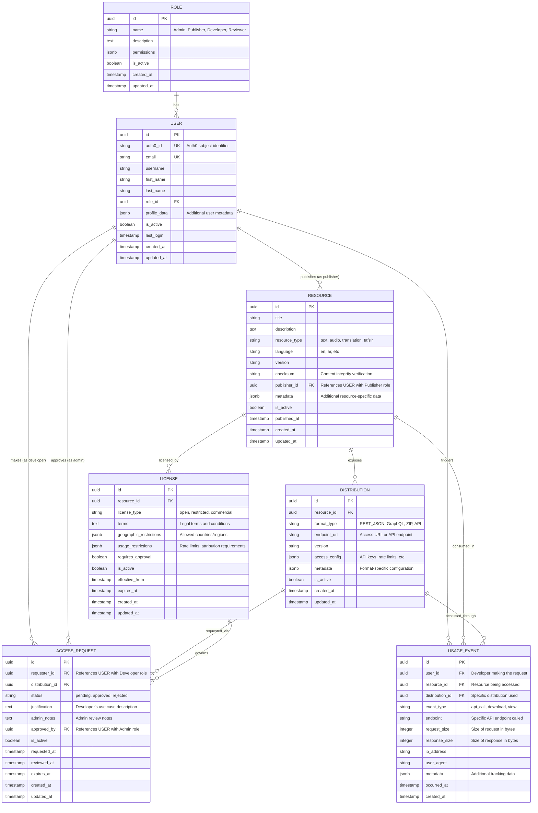

# Level 4: Data Models - Itqan CMS Database Schema

**Audience:** Developers, Implementers  
**Purpose:** Shows detailed database schema for the Quranic Content Management System implementation, matching the high-level ER diagram exactly.

## Entity Descriptions

This database schema represents the **core 7 entities** exactly as shown in the high-level ER diagram for the Itqan Quranic Content Management System.

### Core User Management

#### ROLE
- **Purpose**: Defines the four main roles in the Quranic CMS system
- **Key Fields**: 
  - `name`: ENUM values (Admin, Publisher, Developer, Reviewer)
  - `permissions`: JSONB field defining role-specific capabilities
- **Indexes**: name, is_active
- **Notes**: Each user has exactly one role that determines their system capabilities

#### USER
- **Purpose**: Represents all system users with Auth0 integration
- **Key Fields**:
  - `auth0_id`: Unique identifier from Auth0 identity provider
  - `role_id`: Foreign key to ROLE table
  - `profile_data`: JSONB for flexible user attributes and preferences
- **Indexes**: auth0_id (unique), email (unique), role_id, is_active
- **Notes**: Unified user model supporting Publishers, Developers, Admins, and Reviewers

### Quranic Content Management

#### RESOURCE
- **Purpose**: Core entity representing any Quranic content (text, audio, translations, tafsir)
- **Key Fields**:
  - `resource_type`: ENUM (text, audio, translation, tafsir)
  - `language`: ISO language codes (ar, en, ur, etc.)
  - `checksum`: SHA-256 hash for content integrity verification
  - `publisher_id`: References USER with Publisher role
  - `metadata`: JSONB for resource-specific properties (duration, reciter, etc.)
- **Indexes**: resource_type, language, publisher_id, is_active, published_at
- **Notes**: Central entity for all Quranic content with integrity verification

#### LICENSE
- **Purpose**: Legal terms and conditions governing resource usage
- **Key Fields**:
  - `license_type`: ENUM (open, restricted, commercial)
  - `geographic_restrictions`: JSONB for country/region limitations
  - `usage_restrictions`: JSONB for rate limits, attribution requirements
  - `requires_approval`: Boolean indicating if admin approval is needed
- **Indexes**: resource_id, license_type, requires_approval, is_active
- **Notes**: Multiple licenses can exist per resource for different use cases

#### DISTRIBUTION
- **Purpose**: Specific delivery format/endpoint for accessing a resource
- **Key Fields**:
  - `format_type`: ENUM (REST_JSON, GraphQL, ZIP, API)
  - `endpoint_url`: API endpoint or download URL
  - `access_config`: JSONB for API keys, authentication methods, rate limits
  - `metadata`: JSONB for format-specific configuration
- **Indexes**: resource_id, format_type, is_active
- **Notes**: Multiple distributions per resource enable different access methods

### Access Control & Analytics

#### ACCESS_REQUEST
- **Purpose**: Developer requests for distribution access with approval workflow
- **Key Fields**:
  - `requester_id`: References USER with Developer role
  - `status`: ENUM (pending, approved, rejected)
  - `justification`: Developer's use case description
  - `approved_by`: References USER with Admin role (when approved)
  - `expires_at`: Time-limited access grants
- **Indexes**: requester_id, distribution_id, status, requested_at
- **Notes**: Central workflow entity for controlling distribution access

#### USAGE_EVENT
- **Purpose**: Comprehensive logging for analytics, billing, and compliance
- **Key Fields**:
  - `event_type`: ENUM (api_call, download, view)
  - `endpoint`: Specific API endpoint accessed
  - `request_size/response_size`: For bandwidth analytics
  - `metadata`: JSONB for additional tracking data
- **Indexes**: user_id, resource_id, event_type, occurred_at (partitioned by date)
- **Notes**: High-volume table requiring partitioning for performance

## Relationship Details

### User Relationships
- **ROLE → USER**: One-to-many (each user has exactly one role)
- **USER → RESOURCE**: One-to-many as publisher (Publishers create Resources)
- **USER → ACCESS_REQUEST**: One-to-many as requester (Developers request access)
- **USER → ACCESS_REQUEST**: One-to-many as approver (Admins approve requests)
- **USER → USAGE_EVENT**: One-to-many (tracks all user activity)

### Content Relationships
- **RESOURCE → LICENSE**: One-to-many (multiple licensing options per resource)
- **RESOURCE → DISTRIBUTION**: One-to-many (multiple access formats per resource)
- **RESOURCE → USAGE_EVENT**: One-to-many (tracks resource consumption)

### Access Control Relationships
- **DISTRIBUTION → ACCESS_REQUEST**: One-to-many (developers request specific distributions)
- **DISTRIBUTION → USAGE_EVENT**: One-to-many (tracks distribution usage)
- **LICENSE → ACCESS_REQUEST**: One-to-many (licenses govern access requests)

## Database Design Principles

### Islamic Content Considerations
- **Content Integrity**: Checksum verification for Quranic text accuracy
- **Multilingual Support**: Native support for Arabic and other Islamic languages
- **Scholarly Oversight**: Role-based approval workflows for content quality
- **Flexible Licensing**: Support for Islamic copyright and usage principles

### Performance Optimizations
- **UUID Primary Keys**: Better for distributed systems and security
- **JSONB Fields**: Flexible metadata without schema migrations
- **Strategic Indexes**: On all foreign keys and frequently queried columns
- **Partitioning Strategy**: USAGE_EVENT table partitioned by date for performance

### Data Integrity
- **Foreign Key Constraints**: Strict referential integrity between all entities
- **Unique Constraints**: Prevent duplicates (auth0_id, email)
- **Soft Deletes**: Use is_active flags instead of hard deletes
- **Audit Trail**: Comprehensive timestamping for all entities

### Scalability Features
- **Normalized Design**: Minimal data redundancy with clear relationships
- **Flexible Schema**: JSONB fields allow evolution without migrations
- **Analytics Ready**: USAGE_EVENT structure supports complex analytics queries
- **Multi-Tenant Ready**: Publisher-based isolation through role system

## Implementation Notes

### Django Model Mapping
- Each entity maps to a Django model in the appropriate app:
  - `Role`, `User` → `apps.accounts`
  - `Resource` → `apps.content`
  - `License`, `AccessRequest` → `apps.licensing`
  - `Distribution` → `apps.content` or `apps.api`
  - `UsageEvent` → `apps.analytics`

### Auth0 Integration
- `USER.auth0_id` stores the Auth0 subject identifier
- Django authentication middleware validates Auth0 tokens
- User profiles synchronized between Auth0 and local USER table

### Content Management Workflow
1. **Publisher** creates `RESOURCE` with initial metadata
2. **Publisher** defines `LICENSE` terms for the resource
3. **Publisher** creates `DISTRIBUTION` endpoints for access
4. **Developer** submits `ACCESS_REQUEST` for specific distribution
5. **Admin** reviews and approves/rejects the request
6. **System** logs all access in `USAGE_EVENT` for analytics

This schema provides a solid foundation for the Itqan CMS while maintaining flexibility for future enhancements through the JSONB metadata fields.