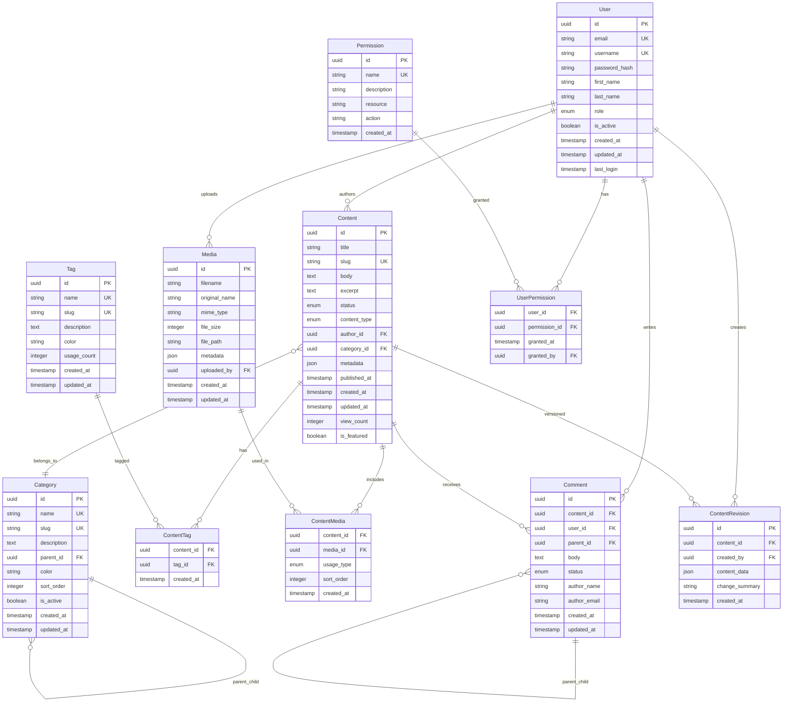

# Level 4: Data Models - Itqan CMS Database Schema

**Audience:** Developers, Implementers  
**Purpose:** Shows class-level/code structure and database schema for implementation.

## Entity Descriptions

### Core Entities

#### User
- **Purpose**: Represents system users (authors, editors, admins)
- **Key Fields**: 
  - `role`: ENUM (admin, editor, author, subscriber)
  - `is_active`: Soft delete mechanism
- **Indexes**: email, username, role, is_active

#### Content
- **Purpose**: Main content entity (articles, pages, posts)
- **Key Fields**:
  - `status`: ENUM (draft, published, archived, deleted)
  - `content_type`: ENUM (article, page, post, product)
  - `metadata`: JSON field for flexible content properties
- **Indexes**: slug, status, content_type, published_at, author_id, category_id

#### Category
- **Purpose**: Hierarchical content organization
- **Key Fields**:
  - `parent_id`: Self-referencing for hierarchy
  - `sort_order`: Manual ordering within same level
- **Indexes**: slug, parent_id, is_active, sort_order

#### Tag
- **Purpose**: Non-hierarchical content labeling
- **Key Fields**:
  - `usage_count`: Denormalized count for performance
- **Indexes**: slug, usage_count

### Media Management

#### Media
- **Purpose**: File and asset management
- **Key Fields**:
  - `metadata`: JSON field for EXIF, dimensions, alt text
  - `file_path`: Relative path in storage system
- **Indexes**: mime_type, uploaded_by, created_at

#### ContentMedia
- **Purpose**: Links content to media assets
- **Key Fields**:
  - `usage_type`: ENUM (featured, gallery, inline, thumbnail)
  - `sort_order`: Order within content
- **Indexes**: content_id, usage_type

### Engagement Features

#### Comment
- **Purpose**: User comments on content
- **Key Fields**:
  - `parent_id`: Threaded comments support
  - `status`: ENUM (pending, approved, spam, deleted)
  - `author_name/email`: For non-registered users
- **Indexes**: content_id, status, parent_id

#### ContentRevision
- **Purpose**: Version control for content changes
- **Key Fields**:
  - `content_data`: Complete content snapshot as JSON
  - `change_summary`: Human-readable description
- **Indexes**: content_id, created_at

### Access Control

#### Permission
- **Purpose**: Granular permission definitions
- **Key Fields**:
  - `resource`: What (content, user, media)
  - `action`: How (create, read, update, delete)
- **Indexes**: name, resource

#### UserPermission
- **Purpose**: Many-to-many user permissions
- **Key Fields**:
  - `granted_at`: Audit trail
  - `granted_by`: Who granted permission
- **Indexes**: user_id, permission_id

## Database Considerations

### Performance
- **UUID Primary Keys**: Better for distributed systems and security
- **Strategic Indexes**: On frequently queried columns
- **JSON Fields**: For flexible metadata without schema changes

### Data Integrity
- **Foreign Key Constraints**: Enforce referential integrity
- **Unique Constraints**: Prevent duplicates (email, username, slugs)
- **Soft Deletes**: Use status flags instead of hard deletes

### Scalability
- **Normalized Design**: Reduces data redundancy
- **Denormalized Counters**: usage_count, view_count for performance
- **Partitioning Ready**: Timestamps support date-based partitioning
