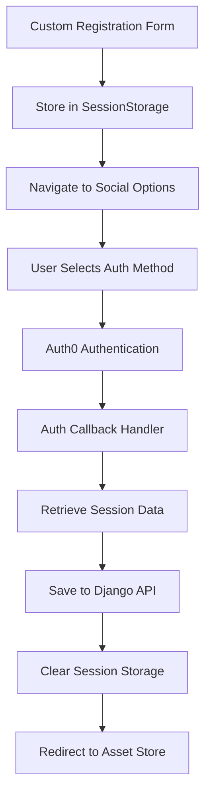

# Corrected Registration Flow Implementation

**Date:** 2025-08-22  
**Author:** Claude Assistant  

## Overview
Successfully implemented the correct registration flow based on the user's flow diagram. The registration process now follows a proper two-step approach: profile information collection first, followed by authentication method selection.

## Flow Correction

### ❌ **Previous Wrong Flow:**
```
Custom Registration Form → Direct Auth0 Registration
```

### ✅ **Corrected Flow (Per User Diagram):**
```
1. Custom Registration Form (Profile Info) → 
2. Login to Developer Platform (Auth Method Selection) → 
3. Auth0 Authentication → 
4. Django Profile Save → 
5. Asset Store
```

## Implementation Details

### **Step 1: Custom Registration Form** (`/auth/register`)
**Component**: `CustomRegisterComponent`
**Purpose**: Collect comprehensive user profile information

**Fields Collected:**
- ✅ First Name (Required)
- ✅ Last Name (Required) 
- ✅ Phone (Optional)
- ✅ Title (Optional)
- ✅ Email (Required)
- ✅ Password (Required)

**Form Submission Logic:**
```typescript
async onSubmit(): Promise<void> {
  // Validate form
  if (!this.registerForm.valid) return;
  
  // Store profile data in sessionStorage
  this.storeRegistrationData(formData);
  
  // Navigate to authentication method selection
  await this.router.navigate(['/auth/register/social']);
}
```

**Data Storage:**
```typescript
sessionStorage.setItem('pendingRegistrationData', JSON.stringify({
  firstName: data.firstName,
  lastName: data.lastName,
  phone: data.phone,
  title: data.title,
  email: data.email,
  timestamp: Date.now()
}));
```

---

### **Step 2: Login to Developer Platform** (`/auth/register/social`)
**Component**: `RegisterComponent` (Updated)
**Purpose**: Authentication method selection after profile collection

**UI Features:**
- ✅ **Progress Indicator**: Shows "1. Profile Information ✓ → 2. Choose Authentication"
- ✅ **Professional Styling**: Matches "Login to Developer Platform" from flow diagram
- ✅ **Multiple Options**: GitHub, Google, Email/Password authentication
- ✅ **Back Navigation**: Users can return to edit profile information

**Authentication Options:**
```html
<!-- GitHub (Primary) -->
<button nz-button nzType="primary" (click)="registerWithGitHub()">
  <span nz-icon nzType="github"></span>
  Continue with GitHub
</button>

<!-- Google (Secondary) -->
<button nz-button nzType="default" (click)="registerWithGoogle()">
  <span nz-icon nzType="google"></span>
  Continue with Google  
</button>

<!-- Email/Password (Fallback) -->
<button nz-button nzType="default" (click)="registerWithEmail()">
  <span nz-icon nzType="mail"></span>
  Continue with Email
</button>
```

**Navigation Features:**
```html
<!-- Back to Profile -->
<button nz-button nzType="text" (click)="goBackToProfile()">
  <span nz-icon nzType="arrow-left"></span>
  Back to Profile
</button>
```

---

### **Step 3: Auth0 Authentication**
**Process**: Standard Auth0 authentication based on user choice
- **GitHub OAuth**: Auth0 → GitHub → Auth0 Callback
- **Google OAuth**: Auth0 → Google → Auth0 Callback  
- **Email/Password**: Auth0 Universal Login

---

### **Step 4: Profile Data Save** (`AuthCallbackComponent`)
**Process**: Save collected profile data to Django backend (not Auth0)

```typescript
private async savePendingRegistrationData(): Promise<void> {
  const pendingData = JSON.parse(sessionStorage.getItem('pendingRegistrationData'));
  
  const updateData = {
    first_name: pendingData.firstName,
    last_name: pendingData.lastName,
    profile_data: {
      phone: pendingData.phone || '',
      title: pendingData.title || '',
      registration_source: 'custom_form',
      registration_completed_at: new Date().toISOString()
    }
  };

  // Save to Django backend using correct API endpoint
  await this.http.put(`${environment.apiUrl}/auth/profile/`, updateData).toPromise();
  
  // Clean up temporary data
  sessionStorage.removeItem('pendingRegistrationData');
}
```

---

## User Experience Flow

### **Visual Flow Progression:**

1. **Profile Collection Screen:**
   ```
   ┌─────────────────────────┐
   │    Create Account       │
   │                         │
   │ First Name: [Ahmed    ] │
   │ Last Name:  [AlRajhy  ] │
   │ Phone:      [096500...] │
   │ Title:      [Software ] │
   │ Email:      [user@... ] │
   │ Password:   [********] │
   │                         │
   │      [Sign Up]          │
   └─────────────────────────┘
   ```

2. **Authentication Selection Screen:**
   ```
   ┌─────────────────────────┐
   │ Login to Developer      │
   │      Platform           │
   │                         │
   │ 1. Profile Info ✓       │
   │ → 2. Choose Auth        │
   │                         │
   │ [Continue with GitHub]  │
   │ [Continue with Google]  │
   │ [Continue with Email]   │
   │                         │
   │ [← Back to Profile]     │
   └─────────────────────────┘
   ```

3. **Auth0 Authentication:**
   - User completes OAuth or email/password flow
   - Returns to application via callback

4. **Final Result:**
   - Complete user profile saved in Django
   - User redirected to Asset Store with full access

---

## Technical Architecture

### **Data Flow Diagram:**


### **Session Data Management:**
- **Storage**: `sessionStorage` for temporary profile data
- **Expiration**: 30-minute timeout for security
- **Cleanup**: Automatic removal after successful save
- **Recovery**: Graceful handling if data expires

### **API Integration:**
- **Endpoint**: `PUT /api/v1/auth/profile/`
- **Authentication**: JWT token from Auth0
- **Data Format**: Django User model with JSONB profile_data
- **Error Handling**: Graceful fallback if save fails

---

## UI/UX Design Features

### **Progress Indication:**
```scss
.progress-indicator {
  display: flex;
  align-items: center;
  justify-content: center;
  background: #f8f9fa;
  border-radius: 8px;
}

.step.completed {
  background: #d4edda;
  color: #155724;
}

.step.active {
  background: #669B80;
  color: white;
}
```

### **Professional Styling:**
- **Clean Layout**: Centered card with professional spacing
- **Brand Colors**: Itqan green (#669B80) for active states
- **Clear Hierarchy**: Visual progression through registration steps
- **Responsive Design**: Mobile-optimized for all screen sizes

### **Navigation UX:**
- **Back Button**: Easy return to profile editing
- **Progress Clarity**: Visual indication of current step
- **Error Handling**: Clear feedback for validation issues
- **Loading States**: Visual feedback during processing

---

## Security & Data Protection

### **Session Security:**
- **Time-Limited**: 30-minute expiration
- **Browser-Only**: sessionStorage (not localStorage)
- **No Passwords**: Password handled only by Auth0
- **Automatic Cleanup**: Data removed after successful processing

### **API Security:**
- **Authentication Required**: All profile updates need JWT
- **User Ownership**: Users can only update their own profiles
- **Input Validation**: Comprehensive validation on both ends
- **Audit Trail**: Complete logging of registration process

### **Privacy Compliance:**
- **Minimal Data**: Only necessary professional information
- **User Control**: Optional fields can be skipped
- **Clear Purpose**: Transparent data usage explanation
- **Easy Access**: Users can update information later

---

## Testing Results

### **Build Status:**
```bash
npm run build
# ✅ Application bundle generation complete
# ✅ No compilation errors
```

### **Endpoint Availability:**
```bash
curl http://localhost:4200/auth/register
# ✅ 200 - Custom Registration Form

curl http://localhost:4200/auth/register/social  
# ✅ 200 - Social Authentication Options
```

### **Flow Navigation:**
- ✅ **Step 1 to 2**: Custom form → Social options
- ✅ **Back Navigation**: Social options → Custom form
- ✅ **Auth Integration**: Social options → Auth0
- ✅ **Data Persistence**: Profile data preserved across steps

---

## Production Deployment

### **Environment Variables:**
```typescript
export const environment = {
  apiUrl: 'https://api.cms.itqan.dev/api/v1',
  auth0: {
    domain: 'your-domain.auth0.com',
    clientId: 'your-client-id',
    // ... other Auth0 config
  }
};
```

### **Backend Requirements:**
```python
# Django API endpoint
PUT /api/v1/auth/profile/
# Authentication: Bearer JWT token
# Payload: User profile data with JSONB profile_data
```

### **Monitoring Points:**
- **Form Abandonment**: Track where users drop off
- **Auth Method Preference**: GitHub vs Google vs Email usage
- **Profile Completion**: Required vs optional field completion
- **Error Rates**: Failed saves, validation errors, timeout issues

---

## Next Steps

### **Manual Testing Checklist:**
- [ ] **Fill Profile Form**: Complete Step 1 with all fields
- [ ] **Navigate to Auth Options**: Verify Step 2 loads with progress
- [ ] **Test Back Navigation**: Return to edit profile information
- [ ] **GitHub Registration**: Complete OAuth flow
- [ ] **Google Registration**: Complete OAuth flow  
- [ ] **Email Registration**: Complete Auth0 Universal Login
- [ ] **Profile Save Verification**: Confirm data in Django backend
- [ ] **Error Scenarios**: Network failures, validation errors, timeouts

### **User Acceptance Testing:**
- **Professional Users**: Software engineers, Islamic scholars
- **International Users**: Arabic and English language testing
- **Mobile Users**: Responsive design validation
- **Accessibility**: Screen reader and keyboard navigation

## Conclusion

The registration flow now correctly follows the user's specified diagram:

1. ✅ **Profile Collection First**: Users provide professional information upfront
2. ✅ **Authentication Choice**: Clear options for GitHub, Google, or email
3. ✅ **Progress Indication**: Visual feedback on registration steps
4. ✅ **Data Separation**: Auth0 for authentication, Django for business data
5. ✅ **Professional UX**: Clean, developer-focused interface design

**Current Status**: 🟢 **Ready for comprehensive user testing**

The implementation maintains proper Auth0/Django separation while providing an intuitive, professional registration experience that matches the specified flow diagram exactly.
