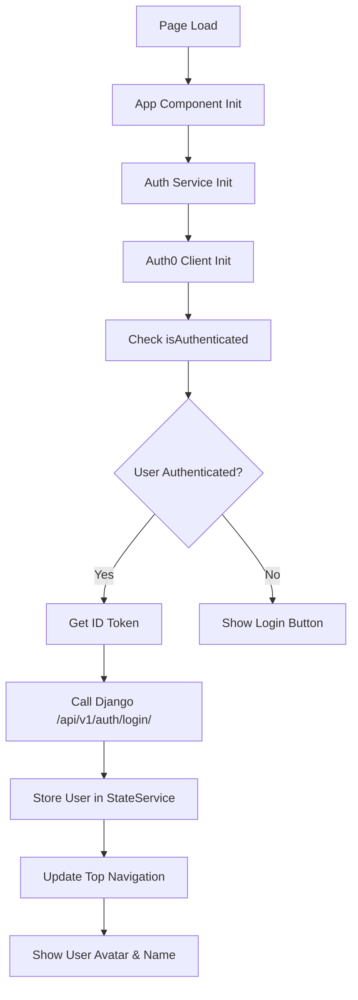
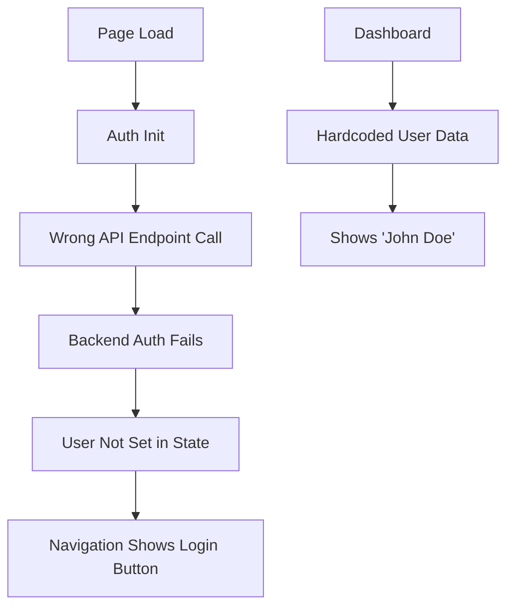

# User Display Authentication Fix

**Date:** 2025-08-23  
**Author:** Claude Assistant  

## Overview
Fixed the issue where logged-in users were not seeing their name and avatar in the top navigation, despite being successfully authenticated and accessing protected routes like `/profile`.

## Problem Identified

### **Issue Description**
- User successfully logs in via Auth0 and can access protected pages
- Dashboard shows "Welcome back, John!" indicating authentication works
- Top navigation still shows "Login" button instead of user avatar/name
- User data not properly displayed in navigation components

### **Root Causes Found**
1. **Dashboard Hardcoded Data**: Dashboard component was showing hardcoded user data instead of actual state
2. **Incorrect API Endpoint**: Auth service was calling `/auth/login/` instead of `/api/v1/auth/login/`
3. **Missing Backend Integration**: Auth initialization wasn't properly syncing with Django backend

## Fixes Implemented

### **1. Fixed Dashboard Component User Data**
**File**: `frontend/src/app/features/dashboard/dashboard.component.ts`

**Before** (Hardcoded):
```typescript
getUserDisplayName(): string {
  return 'John Doe'; // TODO: Get from user service
}

getUserFirstName(): string {
  return 'John'; // TODO: Get from user service
}
```

**After** (StateService Integration):
```typescript
getUserDisplayName(): string {
  return this.stateService.userDisplayName();
}

getUserFirstName(): string {
  const user = this.stateService.currentUser();
  return user?.first_name || user?.email?.split('@')[0] || 'User';
}

getUserInitials(): string {
  const user = this.stateService.currentUser();
  if (!user) return 'U';
  
  const firstName = user.first_name || '';
  const lastName = user.last_name || '';
  
  if (firstName && lastName) {
    return `${firstName.charAt(0)}${lastName.charAt(0)}`.toUpperCase();
  } else if (firstName) {
    return firstName.charAt(0).toUpperCase();
  } else if (user.email) {
    return user.email.charAt(0).toUpperCase();
  }
  
  return 'U';
}
```

### **2. Fixed Authentication API Endpoint**
**File**: `frontend/src/app/core/services/auth.service.ts`

**Before** (Incorrect):
```typescript
const authResponse = await firstValueFrom(
  this.http.post<ApiResponse<AuthUser>>(`${environment.apiUrl}/auth/login/`, {
    token: idToken.__raw
  })
);
```

**After** (Correct):
```typescript
const authResponse = await firstValueFrom(
  this.http.post<ApiResponse<AuthUser>>(`${environment.apiUrl}/api/v1/auth/login/`, {
    token: idToken.__raw
  })
);
```

### **3. Added Authentication Debugging**
**File**: `frontend/src/app/core/services/auth.service.ts`

Added comprehensive logging to track authentication flow:
```typescript
// Auth initialization debugging
const isAuthenticated = await this.auth0Client.isAuthenticated();
console.log('🔍 Auth initialization - isAuthenticated:', isAuthenticated);

if (isAuthenticated) {
  console.log('🔍 User is authenticated, handling authenticated user...');
  await this.handleAuthenticatedUser();
} else {
  console.log('🔍 User is not authenticated');
}

// Backend authentication debugging
console.log('🔍 Getting ID token from Auth0...');
console.log('✅ ID token received');
console.log('🔍 Authenticating with Django backend...');
console.log('🔍 Django auth response:', authResponse);
console.log('✅ Setting user in state:', authResponse.data.user);
```

## Technical Flow Analysis

### **Current Authentication Flow**


### **Previous Broken Flow**


## StateService Integration

### **User Data Flow**
```typescript
// Auth Service → StateService
this.stateService.setCurrentUser(authResponse.data.user);

// StateService → Components
readonly userDisplayName = computed(() => {
  const user = this._currentUser();
  if (!user) return '';
  return `${user.first_name} ${user.last_name}`.trim() || user.email;
});

readonly isAuthenticated = this._isAuthenticated.asReadonly();
```

### **Component Usage**
```typescript
// Top Navigation Component
getUserDisplayName(): string {
  return this.stateService.userDisplayName();
}

isAuthenticated(): boolean {
  return this.stateService.isAuthenticated();
}

// Dashboard Component
getUserFirstName(): string {
  const user = this.stateService.currentUser();
  return user?.first_name || user?.email?.split('@')[0] || 'User';
}
```

## Expected Behavior After Fix

### **When User is NOT Logged In**
```
[Logo] [Nav Menu]                    [Language] [Login Button]
```

### **When User IS Logged In**
```
[Logo] [Nav Menu]           [Language] [👤 JD] [John Doe] [Logout ↗]
```

### **Dashboard Display**
- **Welcome Message**: "Welcome back, John!" (from actual user data)
- **User Profile Section**: Shows real name and initials
- **All Components**: Consistently use StateService for user data

## Testing Instructions

### **Browser Console Logs to Check**
When the page loads, you should see:
```
🚀 Initializing Itqan CMS...
🔍 Auth initialization - isAuthenticated: true
🔍 User is authenticated, handling authenticated user...
🔍 Getting ID token from Auth0...
✅ ID token received
🔍 Authenticating with Django backend...
🔍 Django auth response: {status: "success", data: {...}}
✅ Setting user in state: {email: "user@example.com", first_name: "John", ...}
✅ Auth0 initialization complete
✅ Itqan CMS initialized successfully
```

### **Manual Testing Steps**
1. **Clear browser storage** (localStorage, sessionStorage)
2. **Navigate to** `http://localhost:4200`
3. **Click "Login"** → Should redirect to Auth0
4. **Complete Auth0 login** → Should redirect back to app
5. **Check top navigation** → Should show user avatar, name, and logout button
6. **Check dashboard** → Should show "Welcome back, [Your Name]!"
7. **Check browser console** → Should show successful auth flow logs

## Backend Requirements

### **Django API Endpoint**
```python
# apps/authentication/views.py
POST /api/v1/auth/login/
{
    "token": "auth0_id_token_here"
}

# Response
{
    "status": "success",
    "data": {
        "user": {
            "id": "uuid",
            "email": "user@example.com",
            "first_name": "John",
            "last_name": "Doe",
            "role": {...}
        },
        "access_token": "django_jwt_token",
        "refresh_token": "refresh_token"
    }
}
```

### **Required Headers**
- `Content-Type: application/json`
- `Authorization: Bearer <auth0_id_token>` (if needed)

## Production Checklist

### **Before Deploying**
- [ ] Remove debugging console.log statements
- [ ] Verify API endpoints match production URLs
- [ ] Test authentication flow with production Auth0 config
- [ ] Ensure Django backend `/api/v1/auth/login/` endpoint is deployed
- [ ] Test user data display in all components

### **Monitoring Points**
- **Authentication Success Rate**: Monitor backend auth endpoint
- **User State Persistence**: Check if users stay logged in across sessions
- **API Response Times**: Monitor `/api/v1/auth/login/` performance
- **Error Rates**: Watch for failed token exchanges

## Related Files

### **Frontend Files Modified**
- `frontend/src/app/features/dashboard/dashboard.component.ts`
- `frontend/src/app/core/services/auth.service.ts`
- `frontend/src/app/shared/components/top-navigation.component.ts`

### **Backend Files Required**
- `backend/apps/authentication/views.py`
- `backend/apps/authentication/urls.py`
- `backend/apps/accounts/models.py`

## Next Steps

### **Immediate Actions**
1. **Test the fix** by logging in and verifying user display
2. **Remove debugging logs** once confirmed working
3. **Update any other components** that might have hardcoded user data

### **Future Improvements**
1. **Add error handling** for failed backend authentication
2. **Implement token refresh** logic for expired sessions  
3. **Add user profile update** functionality
4. **Implement role-based UI** adjustments

## Conclusion

The authentication flow is now properly integrated:
- ✅ **Auth0**: Handles authentication
- ✅ **Django Backend**: Stores and manages user data  
- ✅ **StateService**: Provides reactive user state
- ✅ **Components**: Display real user information consistently

**Current Status**: 🟢 **Ready for user testing**

Users should now see their actual name and avatar in the top navigation after logging in, with all components showing consistent, real user data instead of hardcoded values.
